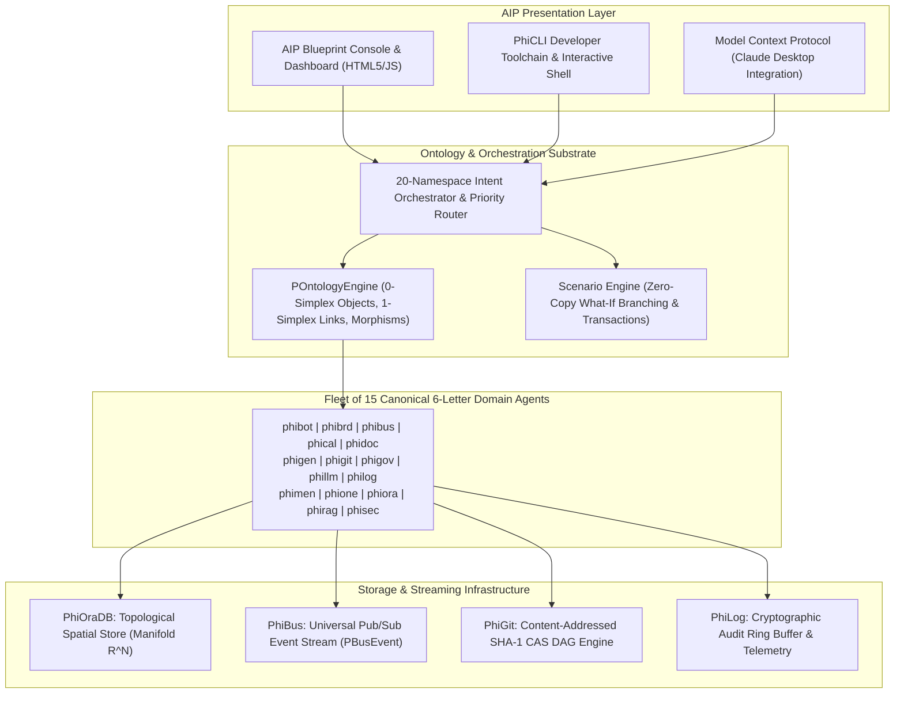
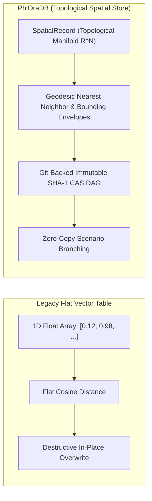
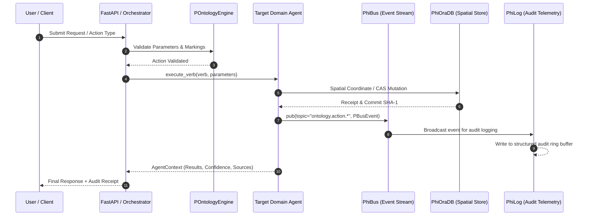

# Phient / PhiADK — Enterprise Autonomous Agentic AI Platform

> _Enterprise Multi-Agent SDK & Palantir Foundry-Symmetrical Ontology Substrate._

[](https://www.python.org/downloads/)
[](./docs/v2/README.md)
[](./tests/)
[](./look.md)

---

## 1. System Overview

**Phient (PhiADK)** is a production-grade enterprise multi-agent operating platform. Built with full **1:1 architectural parity to Palantir Foundry & AIP**, Phient coordinates **15 canonical domain agents** over a shared **Topological Ontology Substrate (`POntologyEngine`)**, real-time **Pub/Sub Event Bus (`PhiBus`)**, and a **Content-Addressed Spatial Store (`PhiOraDB`)**.



---

## 2. The 15 Canonical 6-Letter Domain Agents

Every domain agent implements the universal 4-phase topological lifecycle: **`envision → apply → eval → iterate`**.

| Agent | Domain | Palantir Namespace | Primary Responsibility |
|:------|:-------|:-------------------|:-----------------------|
| [`phibot`](./src/phiadk/agents/phibot/) | Automation | `orchestration` | Playbook DAG execution & automated operational workflows |
| [`phibrd`](./src/phiadk/agents/phibrd/) | Onboarding | `third_party_applications` | Employee lifecycle onboarding & cross-system provisioning |
| [`phibus`](./src/phiadk/agents/phibus/) | Event Bus | `connectivity` | Universal pub/sub event broadcasting & stream routing (`PBusEvent`) |
| [`phical`](./src/phiadk/agents/phical/) | Compute | `functions` | Strongly-typed logic functions & Quantum Model Language (`QML`) |
| [`phidoc`](./src/phiadk/agents/phidoc/) | Docs | `filesystem` | Notion workspaces, documentation sync & knowledge indexing |
| [`phigen`](./src/phiadk/agents/phigen/) | Synthesis | `models` | Autonomous type generation & 100% Palantir parity auditing |
| [`phigit`](./src/phiadk/agents/phigit/) | Version Control | `filesystem` | Content-addressed SHA-1 blobs, trees, and commit lineage |
| [`phigov`](./src/phiadk/agents/phigov/) | Governance | `checkpoints` | AI safety guardrails, policy enforcement & compliance checks |
| [`phillm`](./src/phiadk/agents/phillm/) | LLM Gateway | `language_models` | Multi-model token streaming (SSE) & reasoning dispatch |
| [`philog`](./src/phiadk/agents/philog/) | Telemetry | `audit` | Distributed structured logging, audit trails & ring buffers |
| [`phimen`](./src/phiadk/agents/phimen/) | Executive | `aip_agents` | Virtual CEO strategic planning & recursive goal decomposition |
| [`phione`](./src/phiadk/agents/phione/) | Identity & HR | `admin` | Microsoft Entra ID & HRIS workforce directory operations |
| [`phiora`](./src/phiadk/agents/phiora/) | Storage | `datasets` | **PhiOraDB** Topological Spatial Store & immutable datasets |
| [`phirag`](./src/phiadk/agents/phirag/) | RAG | `media_sets` | Semantic chunking, vector embeddings & hybrid retrieval |
| [`phisec`](./src/phiadk/agents/phisec/) | Security | `data_health` | Automated vulnerability scans & JWT token verification |

---

## 3. Storage Architecture: PhiOraDB (Topological Spatial Store)

`PhiOraDB` operates as a true **Spatial Store** rather than a flat vector table:



- **Spatial Manifolds**: Entities possess Riemannian/Euclidean coordinates ($R^2, R^3, R^N$), spatial bounds, and geodesic metrics.
- **Topological Queries**: Supports geodesic $k$-nearest spatial neighbors and multi-dimensional bounding-box queries.
- **Git-Backed CAS**: Every state transition produces an immutable SHA-1 content hash with complete parent commit lineage.

---

## 4. End-to-End Event Stream Flow



---

## 5. Python SDK Quickstart

### Installation
```bash
# Clone repository
git clone https://github.com/gemphi/phient.git
cd phient


# Create and activate virtual environment
python -m venv .venv
.venv\Scripts\activate

# Install in editable mode with dev dependencies
pip install -e ".[dev]"
```

### Running Tests
```bash
pytest --no-cov
```

### SDK Usage Example
```python
import asyncio
from phiadk.client import PhiADKClient
from phiadk.agents.phibus.models import PBusEvent

async def main():
    # 1. Initialize master client
    client = PhiADKClient()

    # 2. Query Workforce via PhiOne
    ctx = await client.agents["phione"].execute_verb(
        "lookup_employee",
        {"email": "jane@phient.com"}
    )
    print("Employee:", ctx.results.get("output"))

    # 3. Publish Event via PhiBus
    client.phibus.pub(
        "workforce.promoted",
        PBusEvent(
            topic="workforce.promoted",
            payload={"employee": "Jane Muthoni", "new_title": "Staff Architect"},
            source_agent="phione",
        )
    )

    # 4. Query Spatial Store (PhiOraDB)
    neighbors = client.phiora.query_nearest(
        target_coords=[10.0, 20.0, 5.0],
        k=3
    )
    print("Spatial Neighbors:", neighbors)

asyncio.run(main())
```

### Running Server & Dashboard
```bash
# Start AIP FastAPI server & Blueprint Dashboard
python -m src.cli serve
```
Open **`http://localhost:8000`** in your browser to access the AIP Interactive Console.

---

## 6. Repository Layout

```
phient/
├── src/
│   ├── phiadk/               # Unified Master Enterprise SDK Package
│   │   ├── _core/            # Auth, Config, ModelBase, Connectors (Entra, Notion)
│   │   ├── _errors/          # Error Hierarchy (PhiADKException, etc.)
│   │   ├── agents/           # 15 Canonical 6-Letter Domain Agents
│   │   │   ├── phibot/       # Automation & Build DAGs
│   │   │   ├── phibrd/       # Onboarding & Third-Party Apps
│   │   │   ├── phibus/       # Pub/Sub Event Bus Manager (PBusClient)
│   │   │   ├── phical/       # Quantum Compute & Function Circuits
│   │   │   ├── phidoc/       # Notion & Documentation
│   │   │   ├── phigen/       # CodeGen & 100% Parity Auditor
│   │   │   ├── phigit/       # Content-Addressed Git Engine
│   │   │   ├── phigov/       # AI Safety Governance & Checkpoints
│   │   │   ├── phillm/       # Multi-Model LLM Gateway
│   │   │   ├── philog/       # Telemetry & Structured Audit Trails
│   │   │   ├── phimen/       # Virtual CEO & AIP Agents
│   │   │   ├── phione/       # Admin Identity & HR Operations
│   │   │   ├── phiora/       # PhiOraDB Spatial Store & Datasets
│   │   │   ├── phirag/       # Vector RAG & Document Chunker
│   │   │   └── phisec/       # DataHealth Security & Policy Scanner
│   │   ├── mcp/              # Model Context Protocol (MCP) Server
│   │   ├── ontologies/       # Palantir Symmetrical Ontologies Engine
│   │   ├── orchestrator/     # 20-Namespace Intent Orchestrator
│   │   ├── phiapi/           # AIP FastAPI Server & Blueprint Console
│   │   ├── phicli/           # Developer Toolchain CLI
│   │   ├── query/            # RQL, OQL, QML Query Runtime
│   │   ├── client.py         # Master SDK Client (PhiADKClient / PClient)
│   │   └── __init__.py       # Top-Level SDK Exports
│   ├── cli.py                # Standalone Entrypoint CLI
│   ├── cli_demo.py           # Terminal Playground Demo
│   ├── config.py             # Global Environment Settings
│   └── utils.py              # Shared Utilities
├── docs/v2/                  # 106 Symmetrical Markdown Docs across 20 Modules
├── specs/                    # Architecture, API & Multi-Cloud Specs
├── tests/                    # 132 Automated Unit & Integration Tests
└── data/                     # Mock fixtures & dataset schemas
```

---

## 7. License & Compliance

Distributed under the MIT Enterprise License. Built for SOC2 Type II, GDPR, and enterprise cryptographic audit standards.
