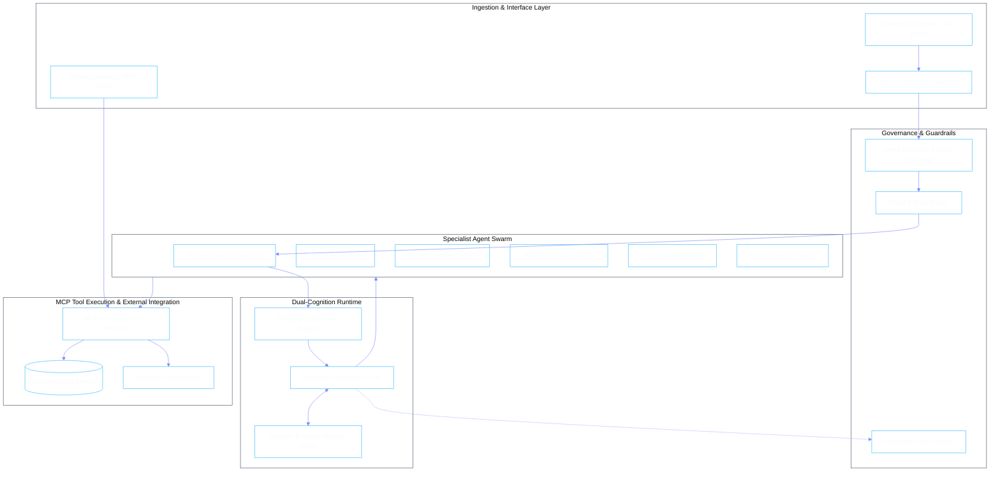

# Phient Platform Overview

Phient is a next-generation enterprise autonomous agent platform designed for mission-critical operations, governed multi-agent swarms, and deterministic tool execution. Inspired by defense-grade and high-assurance architectures (including Palantir AIP and Foundry), Phient provides strict operational guardrails, verifiable execution traces, and seamless human-in-the-loop governance.



## Core Architectural Pillars

### 1. Dual-Cognition Agent Runtime
Autonomous agents in enterprise environments require a separation between high-level deliberative reasoning (goal decomposition, strategy planning, safety verification) and sub-millisecond reflexive execution (tool calls, state transitions, event polling). Phient decouples planning from action via a verified two-phase state machine.

### 2. Model Context Protocol (MCP) Tool Integration
Phient acts as both an MCP Host and an MCP Server. Tools are registered as strongly-typed, schema-validated subroutines with fine-grained parameter validation, timeouts, and sandboxed execution boundaries.

### 3. Palantir-Grade Governance & Guardrails
- **Semantic Invariant Checking**: Every action proposal is checked against pre-configured policy rules before execution.
- **Out-of-Distribution (OOD) Intent Rejection**: Ambiguous, malicious, or non-compliant prompts are quarantined before entering reasoning loops.
- **Full Traceability & Audit Ledger**: Every token, prompt template, tool parameter, and return value is cryptographically recorded in an immutable structured audit log.

### 4. Coordinated Specialist Swarms
Rather than relying on a single monolithic general-purpose LLM, Phient partitions operational domains into eleven specialized agents—each with a constrained operational mandate, strict input/output schemas, and dedicated memory contexts.

---

## Documentation Roadmap

Explore the architecture and operational guides across the platform:

| Section | Description | Key Modules |
|:---|:---|:---|
| **[Architecture](./architecture.md)** | Dual-cognition loop, kernel state machines, and micro-runtime | `phiadk/runtime`, `phiadk/kernel` |
| **[Governance & Security](./governance.md)** | OOD intent detection, policy engine, sandboxing, and audit trails | `src/guardrails`, `src/policy` |
| **[MCP Tooling](./mcp-tooling.md)** | Model Context Protocol server, subroutine registry, and tool contracts | `src/mcp`, `phiadk/mcp` |
| **[Orchestration](./orchestration.md)** | Swarm coordination, message passing, handoffs, and state synchronization | `src/orchestration`, `phiadk/agents` |
| **[Memory & Semantic RAG](./memory-and-rag.md)** | Hybrid dense/sparse indexing, vector search, and episodic recall | `src/rag`, `src/memory` |
| **[PhiADK SDK Guide](./sdk-guide.md)** | Python developer SDK for building and testing custom specialist agents | `phiadk/sdk`, `src/api` |
| **[Specialist Agent Catalog](./agents/README.md)** | Complete reference for all eleven core specialist agents | `phibot`, `phidoc`, `phigit`, `phillm`, `phirag`... |
| **[Telemetry & Auditing](./telemetry.md)** | Structured metrics, OpenTelemetry, Prometheus, and compliance logs | `src/telemetry`, `src/monitoring` |
| **[Production Deployment](./deployment.md)** | High-availability deployment on Kubernetes, Docker, and FastAPI | `docker/`, `helm/`, `deploy/` |

---

## Quickstart

### Installation

```bash
# Clone the repository
git clone https://github.com/gemphi/phient.git
cd phient

# Create and activate virtual environment
python3 -m venv .venv
source .venv/bin/activate  # On Windows: .venv\Scripts\activate

# Install with production & development dependencies
pip install -e ".[dev,mcp]"
```

### Launching the Phient Runtime & MCP Server

```bash
# Start the API gateway with interactive UI
python -m phient.main serve --host 127.0.0.1 --port 8000

# Start the MCP Server over STDIO for Claude Desktop
python -m phient.mcp.server --stdio
```
