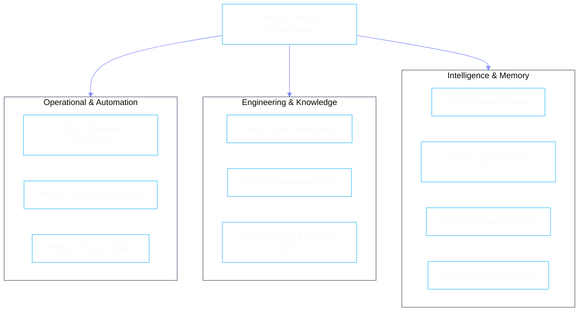

# Specialist Agent Catalog

Phient partitions enterprise operations into eleven domain-focused agents. Each specialist operates with a dedicated domain model, strict verb interface, sandboxed tool access, and isolated state machine.

---

## Agent Directory

| Agent ID | Name | Domain | Primary Verbs | Detailed Guide |
|:---|:---|:---|:---|:---|
| `phione` | **PhiOne** | Master Orchestration | `route_intent`, `coordinate_swarm`, `decompose_goal` | [Guide](./phione.md) |
| `phibot` | **PhiBot** | Workflow Automation | `list_playbooks`, `execute_playbook`, `validate_workflow` | [Guide](./phibot.md) |
| `phibrd` | **PhiBrd** | Protocol Bridge | `bridge_payload`, `translate_protocol`, `sync_events` | [Guide](./phibrd.md) |
| `phical` | **PhiCal** | Temporal Engine | `schedule_job`, `evaluate_cron`, `cancel_schedule` | [Guide](./phical.md) |
| `phidoc` | **PhiDoc** | Knowledge Generator | `extract_ast_docs`, `sync_specifications`, `render_portal` | [Guide](./phidoc.md) |
| `phigit` | **PhiGit** | Code Governance | `inspect_diff`, `audit_pr`, `enforce_branch_policy` | [Guide](./phigit.md) |
| `phillm` | **PhiLLM** | Model Router | `route_prompt`, `optimize_token_budget`, `cache_completion`| [Guide](./phillm.md) |
| `philog` | **PhiLog** | Compliance Journal | `append_audit_record`, `query_audit_trail`, `export_ledger` | [Guide](./philog.md) |
| `phimen` | **PhiMen** | Context & Memory | `store_working_memory`, `recall_episodic_graph`, `prune_context` | [Guide](./phimen.md) |
| `phiora` | **PhiOra** | External Oracle | `resolve_external_dataset`, `validate_oracle_proof` | [Guide](./phiora.md) |
| `phirag` | **PhiRAG** | Hybrid Search | `hybrid_search`, `index_document`, `re_rank_chunks` | [Guide](./phirag.md) |
