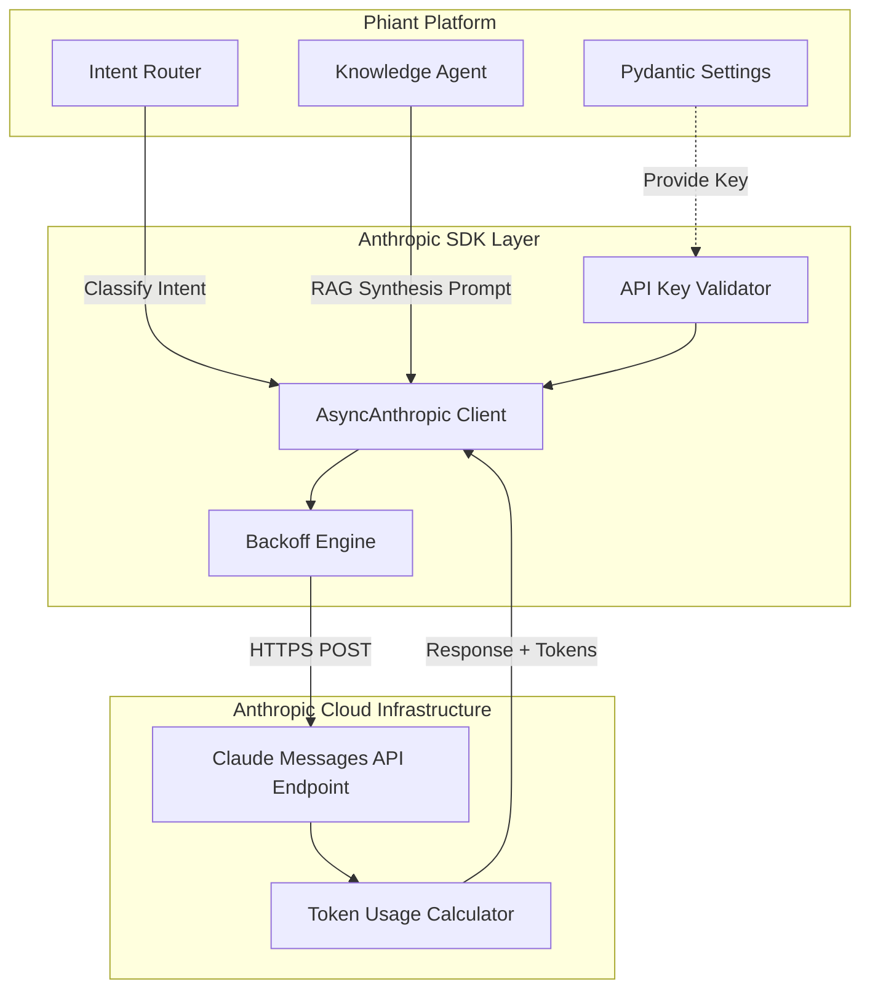
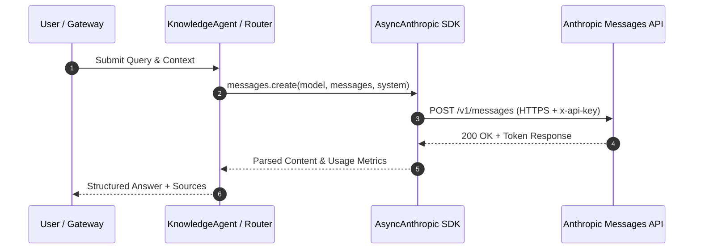

# Dependency Documentation: anthropic

## 1. Overview
- **Package**: `anthropic`
- **Version Constraint**: `>=0.42.0`
- **Category**: LLM Provider Client
- **Primary Modules**: `src/agents/knowledge_agent.py`, `src/orchestrator/router.py`

## 2. What It Does
The `anthropic` Python SDK is the official client library provided by Anthropic to interact with Claude models via the Anthropic Messages API. It handles request formatting, authentication headers (`x-api-key`), non-blocking asynchronous invocation (`AsyncAnthropic`), streaming completions, prompt caching, and structured token usage metrics.

## 3. Why It Was Chosen
1. **Core AI Backbone**: Phiant's AI Ops ecosystem uses Claude 3.5 Sonnet / 4 as its foundational LLM for knowledge synthesis, intent routing, and multi-agent coordination.
2. **Native Async Support**: Non-blocking `AsyncAnthropic` prevents event-loop starvation in FastAPI, allowing high-throughput concurrent agent requests.
3. **Enterprise Reliability**: Provides explicit exception classes (`RateLimitError`, `APIStatusError`, `APIConnectionError`) enabling precise retry and backoff handlers.

## 4. Architectural & System Flow Diagrams

### System Component Structure


### Execution Sequence Diagram


## 5. Alternatives Comparison

| Feature / Metric | Anthropic SDK | OpenAI SDK | LiteLLM |
|------------------|---------------|------------|---------|
| First-Party Support | Direct Anthropic | Direct OpenAI | Wrapper Layer |
| Model Access | Full Claude API | GPT Models | Multi-Provider |
| Async Support | Native AsyncAnthropic | Native AsyncOpenAI | Async Wrapper |
| Latency Overhead | Zero abstraction | Zero abstraction | Minor wrapper overhead |
| Selection Rationale | Primary stack choice for Claude-native tools | N/A | Added complexity for single-primary stack |

## 6. Code Usage Example

```python
from anthropic import AsyncAnthropic
from src.config import settings

class KnowledgeAgent:
    def __init__(self) -> None:
        self.client = AsyncAnthropic(api_key=settings.anthropic_api_key)

    async def _generate(self, query: str, context: str) -> tuple[str, int]:
        user_message = f"Context:\n{context}\n\nQuestion: {query}"
        
        response = await self.client.messages.create(
            model=settings.anthropic_model,
            max_tokens=1024,
            system="You are Phiant's internal Knowledge Agent.",
            messages=[{"role": "user", "content": user_message}],
        )
        
        answer = response.content[0].text
        tokens = response.usage.input_tokens + response.usage.output_tokens
        return answer, tokens
```
