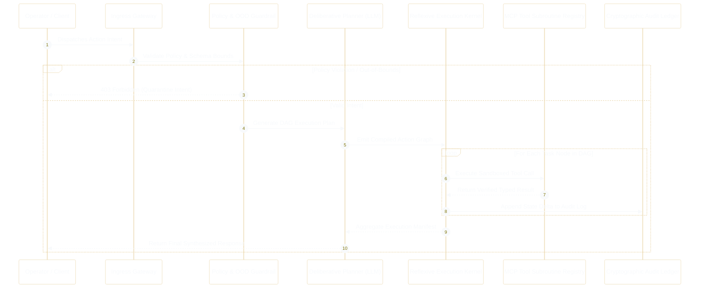
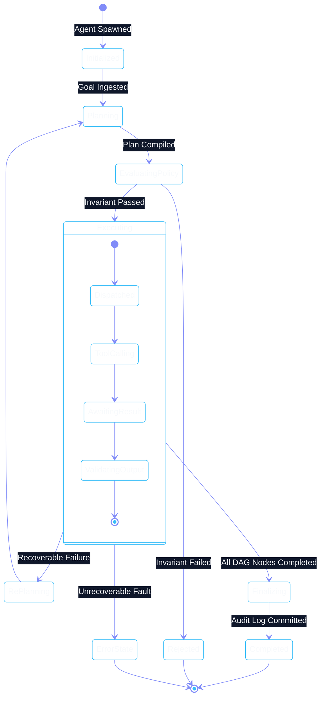

# Dual-Cognition Platform Architecture

Phient is built upon a deterministic micro-kernel architecture that separates **deliberative planning** from **reflexive execution**. This separation guarantees that high-stakes enterprise decisions undergo multi-step verification and invariant checks, while tool execution and data pipelining operate at bare-metal performance.



---

## 1. The Two-Phase Cognition Loop

### Phase I: Deliberative Planning
The deliberative layer functions as the strategic cognitive engine:
- **Intent Disambiguation**: Analyzes ambiguous user requests and requests operator clarification before initiating side effects.
- **DAG Compilation**: Generates a directed acyclic graph (DAG) of sub-tasks, identifying parallelizable execution paths and critical dependencies.
- **Invariant Verification**: Checks proposed tool calls against pre-execution safety invariants (e.g., maximum budget spend, read-only constraints, geographical data residency).

### Phase II: Reflexive Execution Kernel
The reflexive layer is a deterministic Python runtime executing asynchronous event loops:
- **Lock-Free State Synchronization**: Uses atomic state transitions to guarantee consistency across concurrent agent workflows.
- **Subroutine Dispatch**: Routes tool requests to the MCP registry with rigorous timeout, retry, and circuit breaker policies.
- **Dynamic Context Injection**: Streams fresh vector context and episodic memory into the agent context window without bloat.

---

## 2. Micro-Kernel State Machine

The core runtime state machine enforces strict lifecycle transitions for every agent instance:



---

## 3. Data Contracts & Serialization

Every message, intent, plan, and tool invocation in Phient is modeled via strict **Pydantic v2** models backed by `pydantic-core` (Rust):

```python
from pydantic import BaseModel, Field
from typing import Literal, Dict, Any
from datetime import datetime

class AgentActionProposal(BaseModel):
    action_id: str = Field(..., description="Unique UUID for proposed action")
    agent_id: str = Field(..., description="Target specialist agent identifier")
    verb: str = Field(..., description="Target verb to execute on the agent")
    parameters: Dict[str, Any] = Field(default_factory=dict)
    risk_level: Literal["low", "medium", "high", "critical"] = "low"
    requires_human_signoff: bool = False
    proposed_at: datetime = Field(default_factory=datetime.utcnow)

class ExecutionResult(BaseModel):
    action_id: str
    status: Literal["success", "failed", "quarantined"]
    data: Dict[str, Any]
    execution_duration_ms: float
    audit_hash: str
```
