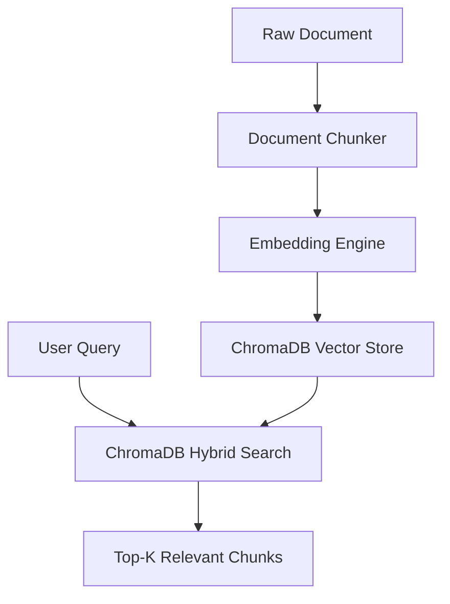

# Dependency Documentation: chromadb

## 1. Overview
- **Package**: `chromadb`
- **Version Constraint**: `>=0.5.0`
- **Category**: Vector Database Engine
- **Primary Modules**: `src/rag/vectorstore.py`, `src/rag/pipeline.py`

## 2. What It Does
`chromadb` is an open-source vector database for storing document embeddings, performing similarity searches (using cosine or HNSW metrics), managing semantic document collections, and executing metadata-filtered queries.

## 3. Why It Was Chosen
1. **RAG Storage**: Core vector database backing Phiant's knowledge retrieval agent.
2. **Zero-Setup Embedded Database**: Runs in-process with zero external server infrastructure during development while supporting cloud deployment.
3. **Metadata Filtering**: Supports exact metadata matching (by department, country, access level).

## 4. Architectural Flow



## 5. Alternatives Comparison

| Feature / Metric | ChromaDB | FAISS | Azure AI Search |
|------------------|----------|-------|-----------------|
| Setup Complexity | Embedded / Zero | Embedded C++ Library | Cloud Service |
| Metadata Filtering | Built-in | Limited | Enterprise Grade |
| Production Migration | Easy (Chroma Server) | Requires custom DB wrapper | Native Azure Integration |
| Selection Rationale | Perfect local/dev vector store with zero friction | Harder metadata filtering | Production cloud upgrade target |

## 6. Code Usage Example

```python
import chromadb

client = chromadb.PersistentClient(path="./data/chroma")
collection = client.get_or_create_collection("phiant_policies")

collection.add(
    documents=["Employees receive 21 days annual leave in Kenya."],
    metadatas=[{"department": "hr", "country": "KE"}],
    ids=["doc-001"]
)

results = collection.query(query_texts=["How many leave days in Kenya?"], n_results=3)
```
