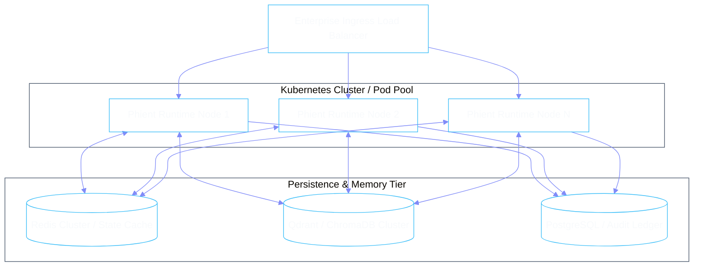

# Production Deployment & Operations

Phient is designed for cloud-native deployment with horizontal scaling across stateless worker nodes and persistent shared memory / database clusters.



---

## 1. Environment Configuration

All settings are configured via environment variables or `.env` files using `pydantic-settings`:

| Variable | Default | Description |
|:---|:---|:---|
| `PHIENT_ENV` | `production` | Environment mode (`development`, `staging`, `production`) |
| `PHIENT_HOST` | `0.0.0.0` | API bind address |
| `PHIENT_PORT` | `8000` | HTTP / WebSocket API port |
| `PHIENT_LOG_LEVEL` | `INFO` | Logging verbosity (`DEBUG`, `INFO`, `WARNING`, `ERROR`) |
| `PHIENT_POLICY_MODE` | `strict` | Enforcement level for guardrails (`permissive`, `strict`) |
| `DATABASE_URL` | - | PostgreSQL connection string for immutable audit ledger |
| `CHROMA_SERVER_HOST` | `127.0.0.1` | ChromaDB vector store hostname |
| `REDIS_URL` | `redis://localhost:6379/0` | Distributed lock & memory cache broker |

---

## 2. Docker Deployment

```dockerfile
FROM python:3.11-slim as builder

WORKDIR /app
RUN apt-get update && apt-get install -y --no-install-recommends gcc libpq-dev git && rm -rf /var/lib/apt/lists/*

COPY pyproject.toml .
RUN pip install --no-cache-dir build && pip install -e .

COPY . .

EXPOSE 8000
CMD ["uvicorn", "phient.main:app", "--host", "0.0.0.0", "--port", "8000", "--workers", "4"]
```

Run via Docker Compose:

```bash
docker-compose up -d --build
```
