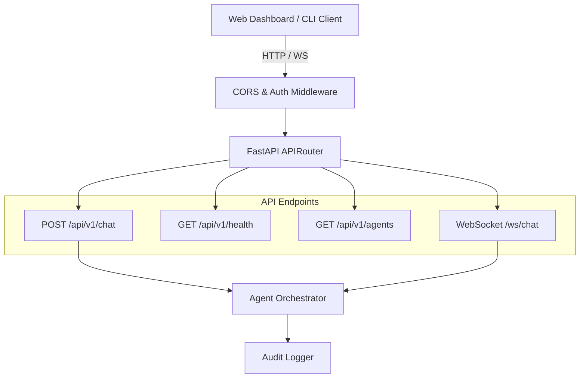
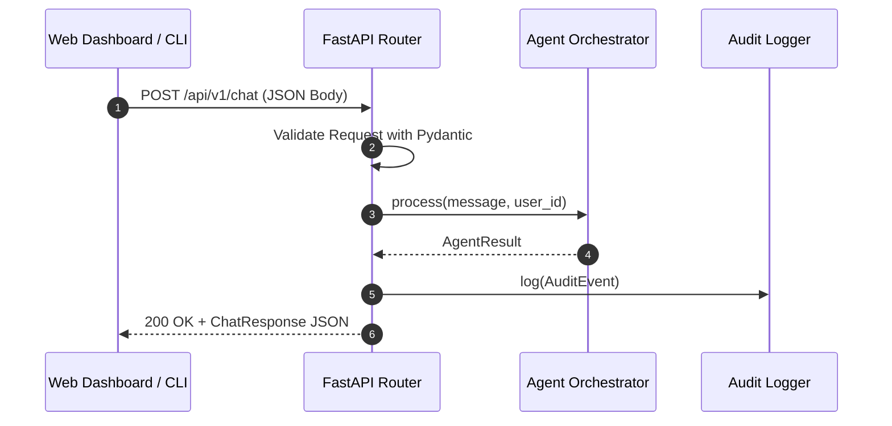

# Dependency Documentation: fastapi

## 1. Overview
- **Package**: `fastapi`
- **Version Constraint**: `>=0.115.0`
- **Category**: Web Gateway & API Framework
- **Primary Modules**: `src/api/main.py`, `src/api/routes.py`, `src/api/models.py`

## 2. What It Does
`fastapi` is a high-performance Python web framework for building REST APIs and WebSocket services. It leverages Pydantic for request/response validation and auto-generates standard OpenAPI documentation.

## 3. Why It Was Chosen
1. **API Gateway**: Serves as the central API gateway powering the Web Dashboard, CLI client, and external integrations.
2. **WebSocket & SSE Support**: Built-in support for real-time WebSocket communication and Server-Sent Events.
3. **Automatic Docs**: Generates interactive OpenAPI (`/docs`) and ReDoc endpoints automatically.

## 4. Architectural & System Flow Diagrams

### API Gateway Architecture


### Request Lifecycle Sequence Diagram


## 5. Alternatives Comparison

| Feature / Metric | FastAPI | Flask | Django REST Framework |
|------------------|---------|-------|-----------------------|
| Async Performance | Native Async | WSGI (requires gevent) | Async Adapters |
| Auto OpenAPI Docs | Built-in | Extension required | Extension required |
| WebSocket Support | Native | Extension required | Django Channels |
| Selection Rationale | Highest performance async web framework for Python | Outdated sync architecture | Overly heavy ORM dependency |

## 6. Code Usage Example

```python
from fastapi import FastAPI, HTTPException
from src.api.models import ChatRequest, ChatResponse

app = FastAPI(title="Phiant AI Ops Gateway")

@app.post("/api/v1/chat", response_model=ChatResponse)
async def chat_endpoint(request: ChatRequest):
    result = await orchestrator.process(query=request.message)
    return ChatResponse(
        request_id=result.task_id,
        response=result.output,
        agent_used=result.agent_name
    )
```
