# Enterprise Governance & Guardrails

In an enterprise deployment, autonomous agents cannot operate as unconstrained black boxes. Phient enforces a multi-tiered security and policy framework modeled after defense and intelligence operational standards.

```mermaid
%%{init: {'theme': 'base', 'themeVariables': {'background': 'transparent', 'mainBkg': 'transparent', 'nodeBorder': '#38bdf8', 'clusterBkg': 'transparent', 'clusterBorder': '#475569', 'lineColor': '#818cf8', 'textColor': '#f8fafc', 'primaryTextColor': '#f8fafc', 'nodeTextColor': '#f8fafc', 'edgeLabelBackground': '#0f172a'}}}%%
graph LR
    subgraph Layer1 ["Layer 1: Semantic Firewall"]
        Input[Raw Prompt] --> OOD[OOD Intent Classifier]
        OOD --> Injection[Prompt Injection Filter]
    end

    subgraph Layer2 ["Layer 2: Policy & RBAC"]
        Injection --> RBAC[Role & Permission Verifier]
        RBAC --> Invariant[Pre-Execution Invariant Checker]
    end

    subgraph Layer3 ["Layer 3: Execution Sandbox"]
        Invariant --> Sandbox[Sandboxed MCP Container]
        Sandbox --> Tool[Validated Tool Call]
    end

    subgraph Layer4 ["Layer 4: Verification & Audit"]
        Tool --> OutputSanitizer[PII / Leakage Sanitizer]
        OutputSanitizer --> HashLedger[Merkle Audit Ledger]
    end
```



---

## 1. Out-of-Distribution (OOD) Intent Guardrails

The Semantic Firewall analyzes incoming requests before they reach the language model planning loops. This prevents:
- **Jailbreaks & Prompt Injections**: Direct and indirect injection attempts are stripped or quarantined.
- **Domain Drift**: Prompts attempting to force specialist agents into domains outside their mandate (e.g., asking `phigit` to execute financial transactions) are instantly redirected to `phione` for re-routing or rejected.
- **Confidentiality Breaches**: Heuristic and embedding-based classifiers detect potential PII or confidential enterprise tokens before ingestion.

---

## 2. Pre-Execution Invariants & Human-in-the-Loop (HITL)

Phient allows operators to define fine-grained execution policies:

```json
{
  "policy_id": "finance_action_policy_v2",
  "rules": [
    {
      "verb": "execute_wire_transfer",
      "conditions": {
        "max_amount_usd": 10000,
        "allowed_destinations": ["vendor_vault_*"]
      },
      "enforcement": "ALLOW"
    },
    {
      "verb": "execute_wire_transfer",
      "conditions": {
        "min_amount_usd": 10000.01
      },
      "enforcement": "REQUIRE_HUMAN_APPROVAL",
      "approver_roles": ["finance_lead", "compliance_officer"]
    },
    {
      "verb": "delete_production_database",
      "enforcement": "DENY"
    }
  ]
}
```

---

## 3. Cryptographic Audit Ledger

Every transaction, state transition, and tool call produces an immutable audit record:
- **Hash Chaining**: Each audit entry contains the SHA-256 hash of the previous entry, forming an unalterable log.
- **Deterministic Replayability**: Actions, environment states, and inputs are preserved to enable bit-for-bit replay in test harnesses.
- **Compliance Export**: Native export formats for SOC2, HIPAA, and ISO27001 audit readiness.
