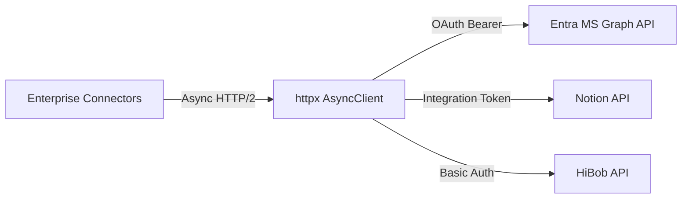

# Dependency Documentation: httpx

## 1. Overview
- **Package**: `httpx`
- **Version Constraint**: `>=0.28.0`
- **Category**: Asynchronous HTTP Client
- **Primary Modules**: `src/connectors/entra.py`, `src/connectors/notion_connector.py`, `src/connectors/hibob.py`

## 2. What It Does
`httpx` is an async HTTP client for Python supporting HTTP/1.1 and HTTP/2, connection pooling, request retries, and clean async/await API integration.

## 3. Why It Was Chosen
1. **Enterprise Connectors**: Powers async requests across Microsoft Entra ID (MS Graph API), Notion API, and HiBob API.
2. **Modern Standards**: Replaces legacy `requests` with async capabilities to prevent event-loop blocking.

## 4. Architectural Flow



## 5. Alternatives Comparison

| Feature | httpx | requests | aiohttp |
|---------|-------|----------|---------|
| Async Support | Native Async Client | Sync Only (Blocks thread) | Async Client |
| API Interface | Requests-compatible API | Standard | Complex Session API |
| Selection Rationale | Modern async standard with familiar API | Unsuitable for async servers | Less intuitive syntax |

## 6. Code Usage Example

```python
import httpx

async def get_user_profile(user_id: str, token: str) -> dict:
    async with httpx.AsyncClient(timeout=10.0) as client:
        response = await client.get(
            f"https://graph.microsoft.com/v1.0/users/{user_id}",
            headers={"Authorization": f"Bearer {token}"}
        )
        response.raise_for_status()
        return response.json()
```
