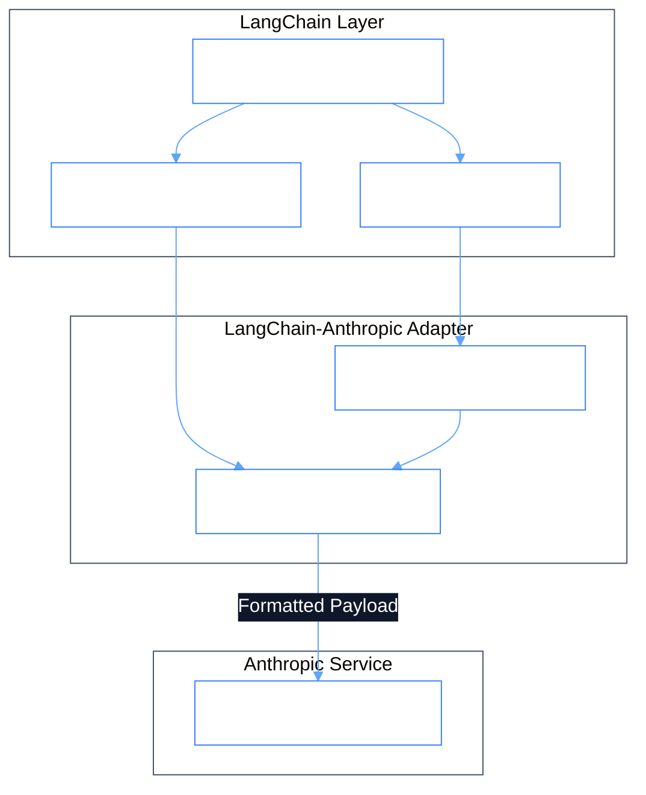
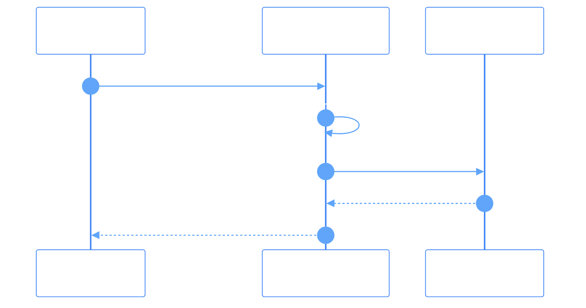

# Dependency Documentation: langchain-anthropic

## 1. Overview
- **Package**: `langchain-anthropic`
- **Version Constraint**: `>=0.3.0`
- **Category**: LangChain Model Integration
- **Primary Modules**: `src/agents/knowledge_agent.py`, `src/orchestrator/router.py`

## 2. What It Does
`langchain-anthropic` is the specialized integration library connecting LangChain's `BaseChatModel` interface directly to Anthropic's API via `ChatAnthropic`. It handles model invocation, prompt formatting, native tool calling, and response parsing.

## 3. Why It Was Chosen
1. **First-Party Integration**: Maintained by LangChain and Anthropic to ensure prompt alignment and zero-day feature updates.
2. **Native Tool Calling**: Automatically translates LangChain tool schemas into Claude's native JSON tool calling format.
3. **Structured Outputs**: Simplifies Pydantic-based output parsing directly from Claude responses.

## 4. Architectural & System Flow Diagrams

### Component Structure


### Execution Sequence Diagram


## 5. Alternatives Comparison

| Feature / Metric | langchain-anthropic | Raw HTTP Calls | Generic OpenAI Wrapper |
|------------------|---------------------|----------------|------------------------|
| Maintenance | Official Anthropic Package | Self-Maintained | Third-party proxy |
| Tool Schema Conversion | Automatic | Manual JSON Schema | Incompatible format |
| Async Streaming | Supported | Manual SSE Parsing | Varies |
| Selection Rationale | Required bridge between LangChain and Anthropic API | High development overhead | Not tailored for Claude |

## 6. Code Usage Example

```python
from langchain_anthropic import ChatAnthropic

llm = ChatAnthropic(
    model="claude-3-5-sonnet-20241022",
    temperature=0.2,
    max_tokens=1024,
)

response = await llm.ainvoke("Classify intent: Onboard new engineer")
```
