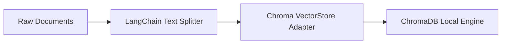

# Dependency Documentation: langchain-community

## 1. Overview
- **Package**: `langchain-community`
- **Version Constraint**: `>=0.3.0`
- **Category**: Community Integrations
- **Primary Modules**: `src/rag/vectorstore.py`, `src/rag/pipeline.py`

## 2. What It Does
`langchain-community` contains third-party vector store adapters, document splitters, and connector utilities maintained by the LangChain open-source community.

## 3. Why It Was Chosen
1. **ChromaDB Adapter**: Integrates ChromaDB vector store into LangChain's retrieval pipeline.
2. **Modular Footprint**: Keeps third-party dependencies separated from core agent logic.

## 4. Architectural Flow



## 5. Alternatives Comparison

| Feature | langchain-community | Custom Wrappers | Direct API |
|---------|---------------------|-----------------|------------|
| Vector Store Support | 50+ Stores | Manual per store | Manual per store |
| Maintenance | Open-Source Community | Internal Team | Internal Team |
| Selection Rationale | Standardized vector store interface | High overhead | Redundant code |

## 6. Code Usage Example

```python
from langchain_community.vectorstores import Chroma

vectorstore = Chroma(
    collection_name="phiant_policies",
    persist_directory="./data/chroma",
)
```
