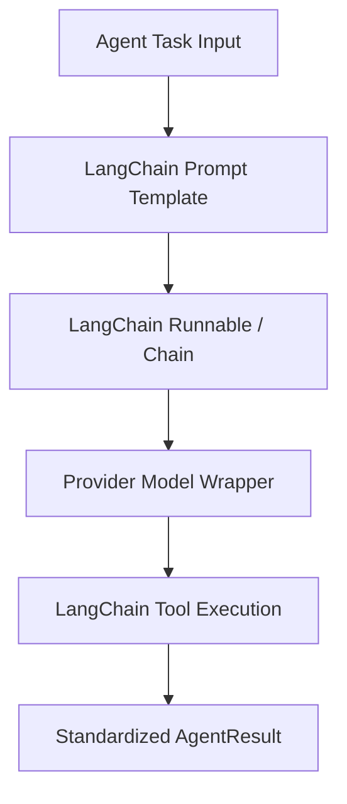

# Dependency Documentation: langchain

## 1. Overview
- **Package**: `langchain`
- **Version Constraint**: `>=0.3.0`
- **Category**: AI Agent & Chain Framework
- **Primary Modules**: `src/agents/base_agent.py`, `src/orchestrator/orchestrator.py`

## 2. What It Does
`langchain` provides foundational abstractions for building LLM applications. It standardizes message representations (`HumanMessage`, `AIMessage`, `SystemMessage`), prompt templates, memory abstractions, and tool interfaces across multi-agent pipelines.

## 3. Why It Was Chosen
1. **Industry Standard Schema**: Establishes uniform data contracts across all 6 specialized agents in the Phiant ecosystem.
2. **Ecosystem Interoperability**: Pairs directly with LangGraph for agentic state machine graph construction.
3. **Decoupled Architecture**: Version 0.3+ decouples core abstractions (`langchain-core`) from integrations (`langchain-community`), ensuring a lightweight base footprint.

## 4. Architectural Flow



## 5. Alternatives Comparison

| Feature / Metric | LangChain | LlamaIndex | Custom Code |
|------------------|-----------|------------|-------------|
| Agent Orchestration | Excellent (via LangGraph) | Focused on Data Indexing | High Maintenance |
| Integration Ecosystem | Massive (1000+ connectors) | Strong for RAG | Manual API Wrappers |
| Production Maturity | High (v0.3 standard) | Medium | Dependent on team |
| Selection Rationale | Standard for enterprise multi-agent workflows | Selected for RAG index only | Avoid reinventing standards |

## 6. Code Usage Example

```python
from langchain_core.prompts import ChatPromptTemplate
from langchain_core.messages import SystemMessage, HumanMessage

prompt = ChatPromptTemplate.from_messages([
    ("system", "You are Phiant's AI Ops assistant."),
    ("human", "{user_query}")
])

formatted_messages = prompt.format_messages(user_query="What is the leave policy?")
```
