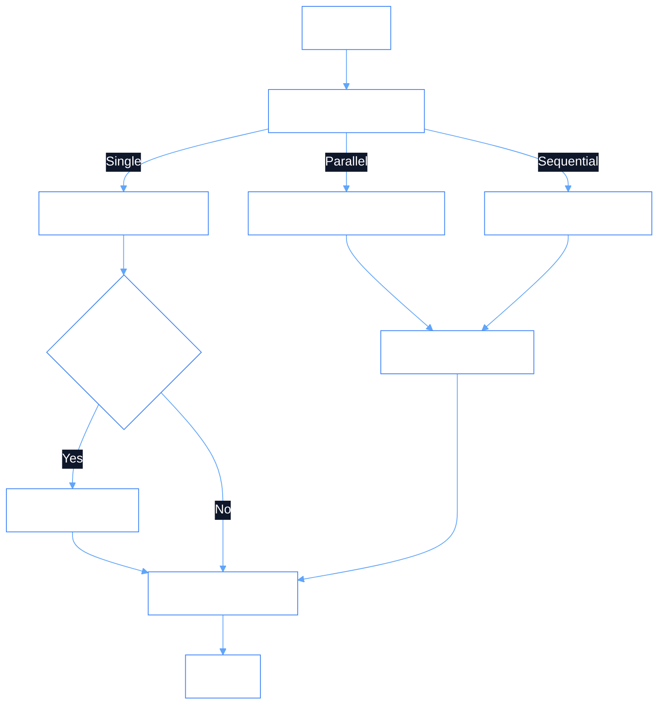

# Dependency Documentation: langgraph

## 1. Overview
- **Package**: `langgraph`
- **Version Constraint**: `>=0.3.0`
- **Category**: Multi-Agent State Orchestration Framework
- **Primary Modules**: `src/orchestrator/orchestrator.py`, `src/orchestrator/state.py`

## 2. What It Does
`langgraph` provides a graph-based state machine framework for orchestrating multi-agent systems. It models agent interactions as nodes and edges in a graph, managing state transitions, parallel branch execution, conditional routing, cyclic execution, and approval pause points.

## 3. Why It Was Chosen
1. **Multi-Agent Coordination**: Phient requires orchestrating 6 agents across single, sequential, and parallel modes.
2. **State Machine Persistence**: Ensures complete state tracking across multi-step processes like employee onboarding.
3. **Approval Gates**: Supports human-in-the-loop approval workflows for destructive identity operations.

## 4. Architectural Flow



## 5. Alternatives Comparison

| Feature / Metric | LangGraph | AutoGen | CrewAI |
|------------------|-----------|---------|--------|
| State Control | Exact Graph Control | Conversational Loop | Role-based Delegation |
| Human-in-the-Loop | Built-in Interrupts | Partial | Limited |
| Production Focus | High (LangChain Ecosystem) | Research / Experimental | Simple Automations |
| Selection Rationale | Precision graph control for enterprise tasks | Too unpredictable | Lacks granular state control |

## 6. Code Usage Example

```python
from langgraph.graph import StateGraph, END
from src.orchestrator.state import OrchestratorState

builder = StateGraph(OrchestratorState)
builder.add_node("router", route_intent)
builder.add_node("execute_agent", run_selected_agent)
builder.set_entry_point("router")
builder.add_edge("router", "execute_agent")
builder.add_edge("execute_agent", END)
graph = builder.compile()
```
