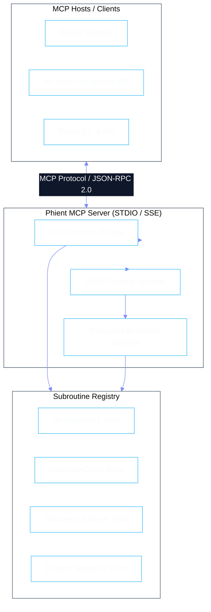

# Model Context Protocol (MCP) & Subroutine Registry

The **Model Context Protocol (MCP)** is an open standard enabling seamless, secure tool integration between AI models and external data sources. Phient provides a native MCP server and subroutine registry that transforms Python functions and microservices into discoverable, schema-verified tools.



---

## 1. Registering a Subroutine Tool

Defining a new tool in Phient requires a standard Python function decorated with `@mcp_subroutine` and explicit Pydantic type annotations:

```python
from pydantic import BaseModel, Field
from phient.mcp import mcp_subroutine

class QueryDatabaseArgs(BaseModel):
    sql_query: str = Field(..., description="Read-only SQL query to execute")
    max_rows: int = Field(default=100, ge=1, le=1000)
    database_id: str = Field(..., description="Target database identifier")

@mcp_subroutine(
    name="query_enterprise_database",
    description="Executes a sanitized read-only SQL query against the specified enterprise data warehouse.",
    risk_level="medium",
    timeout_seconds=30
)
async def query_enterprise_database(args: QueryDatabaseArgs) -> dict:
    # 1. Automatic safety validation (disallow DROP, DELETE, ALTER, INSERT, UPDATE)
    if any(keyword in args.sql_query.upper() for keyword in ["DROP", "DELETE", "ALTER", "INSERT", "UPDATE"]):
        raise ValueError("Write operations are disallowed in read-only database subroutine.")
        
    # 2. Execution via connection pool
    results = await db_pool.fetch(args.database_id, args.sql_query, limit=args.max_rows)
    return {"rows": results, "count": len(results)}
```

---

## 2. Claude Desktop Integration

To connect Claude Desktop to Phient's full suite of specialist agents and MCP tools, add the following configuration to `claude_desktop_config.json`:

```json
{
  "mcpServers": {
    "phient": {
      "command": "python",
      "args": ["-m", "phient.mcp.server", "--stdio"],
      "env": {
        "PHIENT_ENVIRONMENT": "production",
        "PHIENT_POLICY_MODE": "strict"
      }
    }
  }
}
```

---

## 3. Sandboxing & Timeout Guarantees

Every tool invocation executes with strict operational boundaries:
- **Asynchronous Deadlock Protection**: Subroutines enforce strict timeouts (`asyncio.wait_for`).
- **Memory & Resource Caps**: Large result sets are automatically paginated or streamed to prevent context window overflow.
- **Fail-Safe Circuit Breakers**: If a tool fails repeatedly, it enters a cooldown state to prevent cascading errors across the swarm.
