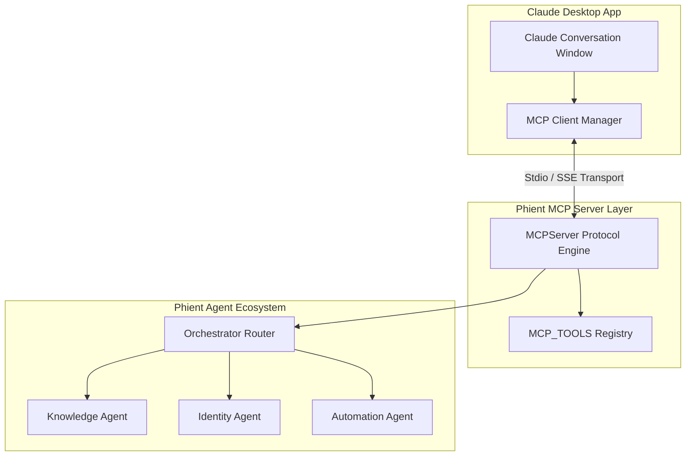
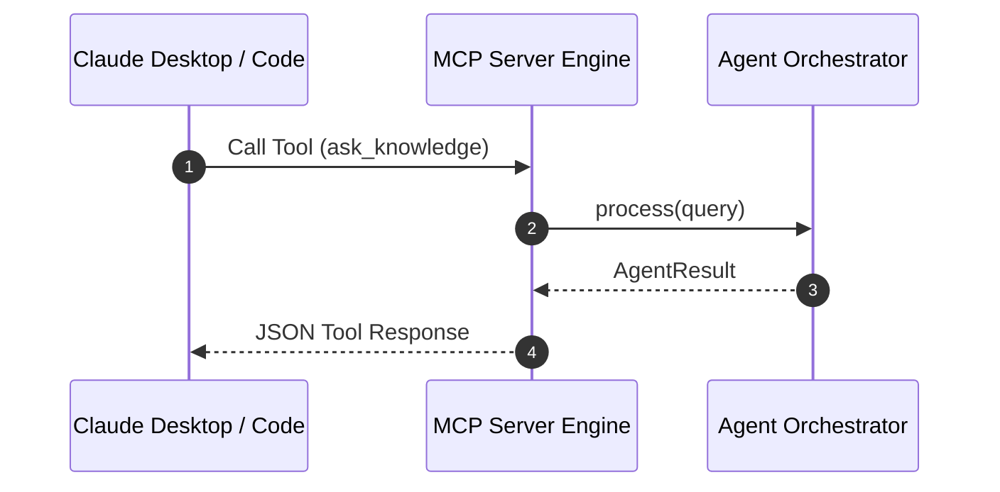

# Dependency Documentation: mcp

## 1. Overview
- **Package**: `mcp`
- **Version Constraint**: `>=1.0.0`
- **Category**: Model Context Protocol SDK
- **Primary Modules**: `src/mcp/server.py`, `src/mcp/tools.py`

## 2. What It Does
`mcp` implements the Model Context Protocol standard by Anthropic, enabling applications to expose tools, resources, and prompts to Claude Desktop and Claude Code.

## 3. Why It Was Chosen
1. **Claude Ecosystem Integration**: Allows Phient engineers to invoke agents directly inside Claude Desktop and IDE tool extensions.
2. **Standard Protocol**: Open protocol implementation.

## 4. Architectural & System Flow Diagrams

### MCP Tool Registration Architecture


### Execution Sequence Diagram


## 5. Alternatives Comparison

| Feature | MCP SDK | Custom REST API | Custom Plugin System |
|---------|---------|-----------------|----------------------|
| Native Claude Support | Yes | Requires API plugin | No |
| Selection Rationale | Official standard for Claude Desktop integrations | Lacks native desktop integration | Reinventing wheel |

## 6. Code Usage Example

```python
from src.mcp.tools import MCP_TOOLS

class MCPServer:
    def __init__(self, orchestrator):
        self.orchestrator = orchestrator
        self.tools = MCP_TOOLS
```
