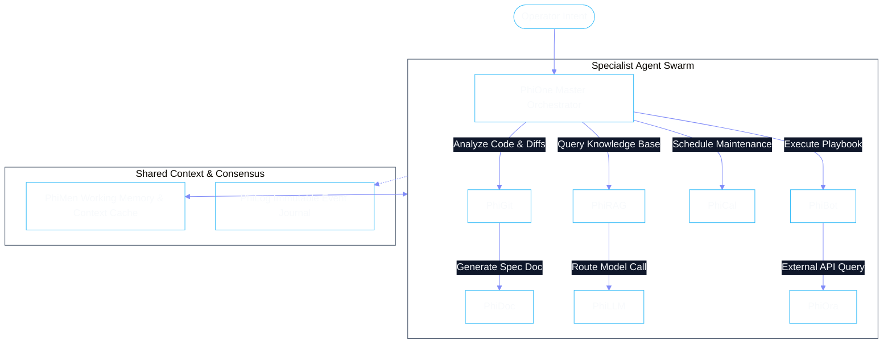

# Multi-Agent Swarm Orchestration

Enterprise operations often exceed the capabilities of a single cognitive actor. Phient orchestrates a decentralized swarm of specialist agents through a deterministic state machine, structured message passing, and clear delegation protocols.



---

## 1. Agent Handoff Protocol

When an agent recognizes that a sub-task lies outside its specialized domain, it initiates a **Typed Handoff**:

1. **Context Snapshot**: The current agent serializes the relevant task slice and intermediate results into a `HandoffEnvelope`.
2. **Intent Delegation**: The handoff is submitted to `phione` (or directly to a target peer if authorized).
3. **Receipt & Verification**: The recipient agent validates the envelope schema and acknowledges receipt before the initiating agent transitions to an idle or waiting state.

```python
from phiadk.models import HandoffEnvelope

async def initiate_doc_generation(pr_diff: str, pr_id: int):
    envelope = HandoffEnvelope(
        source_agent="phigit",
        target_agent="phidoc",
        task_type="generate_release_documentation",
        payload={
            "diff": pr_diff,
            "pr_number": pr_id,
            "style_guide": "palantir_enterprise"
        }
    )
    return await phione_router.dispatch_handoff(envelope)
```

---

## 2. Preventing Deadlocks & Runaway Loops

To ensure 100% operational reliability in production:
- **Max Hop Limits**: Every request thread tracks a hop counter; any workflow exceeding the threshold is immediately escalated to an operator.
- **DAG Cycle Detection**: Plans generated by the deliberative loop are checked for circular dependencies before execution begins.
- **Token & Cost Budgets**: Each sub-agent consumes from a unified parent transaction budget; exhaustion terminates downstream execution gracefully.
