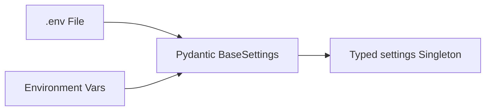

# Dependency Documentation: pydantic-settings

## 1. Overview
- **Package**: `pydantic-settings`
- **Version Constraint**: `>=2.7.0`
- **Category**: Settings Management
- **Primary Modules**: `src/config.py`

## 2. What It Does
`pydantic-settings` provides configuration management by parsing environment variables, secrets, and `.env` files into type-safe Pydantic settings models.

## 3. Why It Was Chosen
1. **Type-Safe Application Config**: Validates required credentials (API keys for Anthropic, Entra, Notion, Enterprise HRIS) at application boot time.
2. **Fail-Fast Validation**: Prevents starting the service with missing configuration keys.

## 4. Architectural Flow



## 5. Alternatives Comparison

| Feature | pydantic-settings | os.environ | python-decouple |
|---------|-------------------|------------|-----------------|
| Type Validation | Built-in Pydantic | Manual Casting | Basic Casting |
| Fail-Fast Boot | Automatic | Manual Checks | Basic |
| Selection Rationale | Best practice for Pydantic/FastAPI ecosystems | Prone to runtime KeyErrors | Less features |

## 6. Code Usage Example

```python
from pydantic_settings import BaseSettings

class Settings(BaseSettings):
    anthropic_api_key: str = ""
    api_port: int = 8000
    
    model_config = {"env_file": ".env"}

settings = Settings()
```
