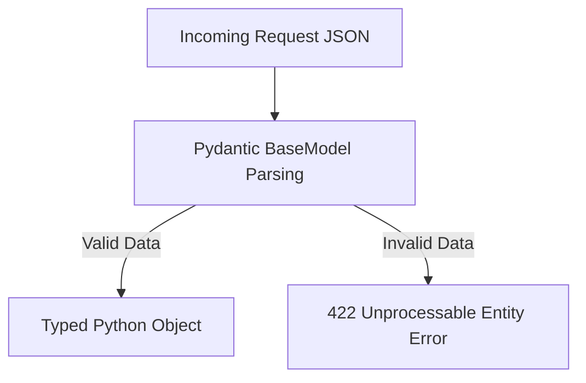

# Dependency Documentation: pydantic

## 1. Overview
- **Package**: `pydantic`
- **Version Constraint**: `>=2.10.0`
- **Category**: Data Validation & Schema Modeling
- **Primary Modules**: `src/api/models.py`, `src/config.py`, `src/agents/base_agent.py`

## 2. What It Does
`pydantic` provides data validation and serialization leveraging Python type annotations. Version 2 is powered by a high-performance Rust core (`pydantic-core`), delivering validation speeds up to 20x faster than Version 1.

## 3. Why It Was Chosen
1. **API Data Contracts**: Defines request and response payload schemas for FastAPI endpoints.
2. **Type Coercion & Validation**: Ensures all agent task inputs and output dictionaries conform to expected data types.

## 4. Architectural Flow



## 5. Alternatives Comparison

| Feature | Pydantic v2 | Marshmallow | dataclasses |
|---------|-------------|-------------|-------------|
| Performance | Fast (Rust Core) | Medium (Python) | Fast (Built-in) |
| Validation Engine | Strict runtime typing | Schema-based | Manual validation |
| Selection Rationale | Native FastAPI integration and Rust-powered speed | Outdated syntax | Lacks runtime validation |

## 6. Code Usage Example

```python
from pydantic import BaseModel, Field

class ChatRequest(BaseModel):
    message: str = Field(..., description="User query message")
    user_id: str = Field(default="anonymous")
    priority: str | None = None
```
