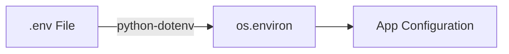

# Dependency Documentation: python-dotenv

## 1. Overview
- **Package**: `python-dotenv`
- **Version Constraint**: `>=1.0.0`
- **Category**: Environment Loader
- **Primary Modules**: `src/config.py`

## 2. What It Does
`python-dotenv` loads key-value pairs from `.env` files into `os.environ`.

## 3. Why It Was Chosen
1. **Developer Experience**: Simplifies local development configuration without requiring global shell exports.

## 4. Architectural Flow



## 5. Alternatives Comparison

| Feature | python-dotenv | Manual Shell Exports |
|---------|---------------|----------------------|
| DX Convenience | High | Low |
| Selection Rationale | Standard Python env file parser | Friction for local dev |

## 6. Code Usage Example

```python
from dotenv import load_dotenv

load_dotenv()  # Reads .env into os.environ
```
