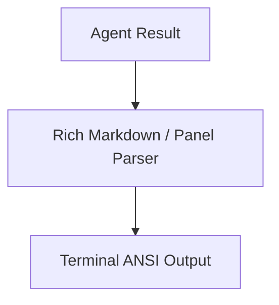

# Dependency Documentation: rich

## 1. Overview
- **Package**: `rich`
- **Version Constraint**: `>=13.9.0`
- **Category**: Terminal Formatting & UI
- **Primary Modules**: `src/cli.py`, `src/cli_demo.py`

## 2. What It Does
`rich` provides rich text formatting, ANSI color rendering, markdown parsing, tables, panels, and live progress indicators in command-line terminals.

## 3. Why It Was Chosen
1. **CLI User Experience**: Displays formatted markdown agent responses, status tables, and banners for CLI users.
2. **Rich Aesthetics**: Delivers modern terminal UI design.

## 4. Architectural Flow



## 5. Alternatives Comparison

| Feature | Rich | Colorama | Tabulate |
|---------|------|----------|----------|
| Markdown Support | Native | None | None |
| Table Styling | Advanced | Basic | Basic |
| Selection Rationale | Comprehensive terminal rendering suite | Color-only | Tables-only |

## 6. Code Usage Example

```python
from rich.console import Console
from rich.panel import Panel
from rich.markdown import Markdown

console = Console()
console.print(Panel(Markdown("### Agent Output"), border_style="bright_cyan"))
```
