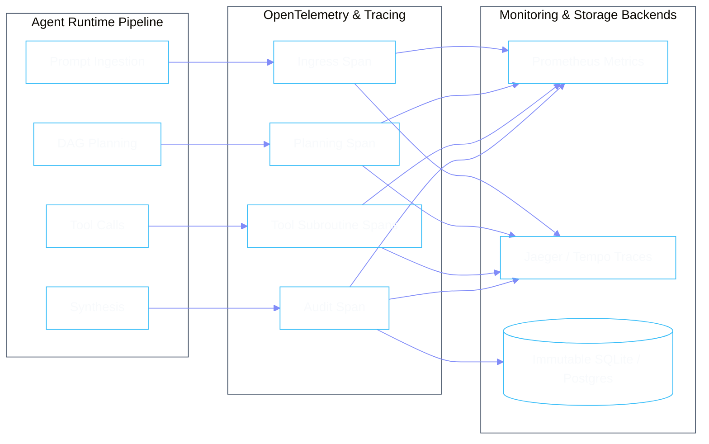

# Telemetry, Observability & Auditing

Enterprise governance requires complete transparency into every automated decision, token spent, and latency budget consumed. Phient provides built-in OpenTelemetry instrumentation and structured logging.



---

## 1. Key Metrics & SLIs

| Metric Name | Type | Description |
|:---|:---|:---|
| `phient_agent_requests_total` | Counter | Total requests routed to specialist agents |
| `phient_task_duration_seconds` | Histogram | End-to-end task execution latency |
| `phient_llm_tokens_consumed_total` | Counter | Input and output tokens segmented by model & agent |
| `phient_policy_violations_total` | Counter | Number of quarantined or blocked action intents |
| `phient_tool_errors_total` | Counter | Subroutine tool call failures and timeouts |

---

## 2. Structured JSON Logging

All log lines adhere to RFC 5424 structured JSON formatting:

```json
{
  "timestamp": "2026-08-28T20:45:00.123Z",
  "level": "INFO",
  "agent_id": "phigit",
  "trace_id": "4bf92f3577b34da6a3ce929d0e0e4736",
  "span_id": "00f067aa0ba902b7",
  "event": "tool_executed",
  "tool_name": "git_commit_analysis",
  "duration_ms": 42.5,
  "cost_usd": 0.00042,
  "status": "SUCCESS"
}
```
