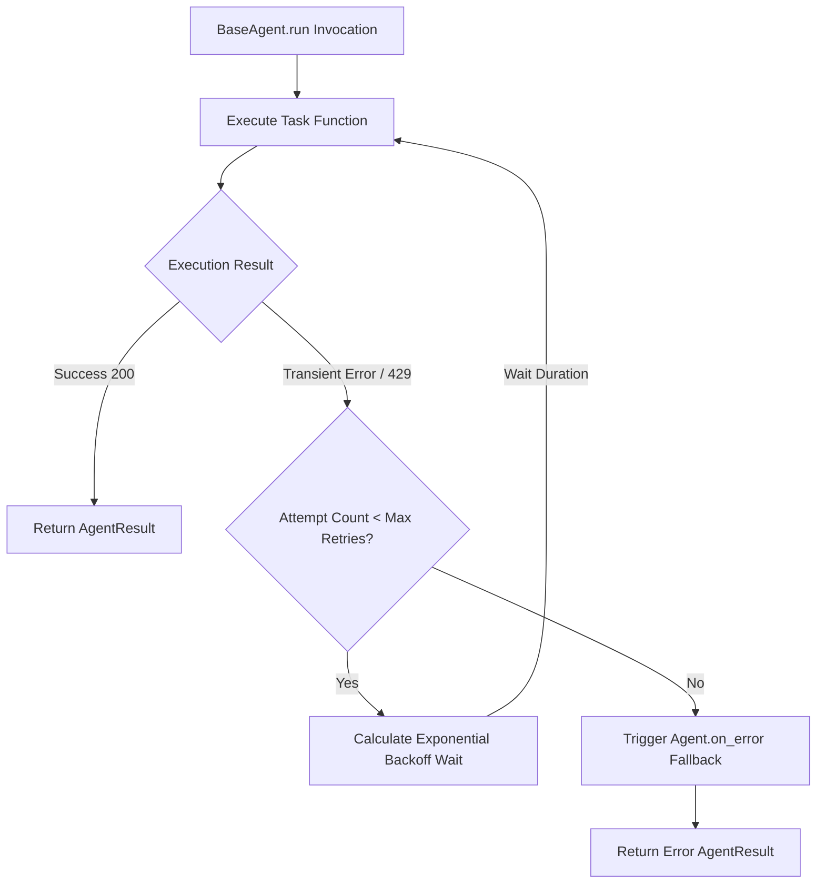
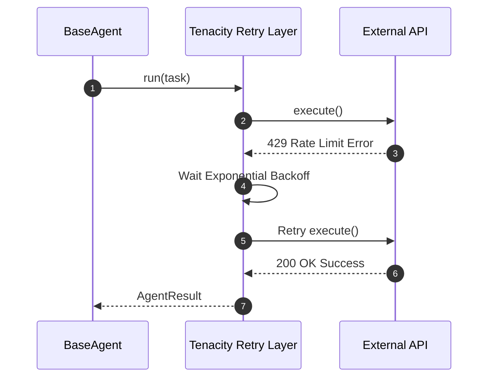

# Dependency Documentation: tenacity

## 1. Overview
- **Package**: `tenacity`
- **Version Constraint**: `>=9.0.0`
- **Category**: Resilience & Retry Library
- **Primary Modules**: `src/agents/base_agent.py`

## 2. What It Does
`tenacity` is a Python retry library supporting exponential backoff, custom wait strategies, and error matching predicates.

## 3. Why It Was Chosen
1. **API Resilience**: Retries external API calls (Anthropic/Entra) upon transient 429 or network errors.
2. **Declarative Decorators**: Wraps `BaseAgent.run` logic cleanly.

## 4. Architectural & System Flow Diagrams

### Resilience & Retry Flowchart


### Execution Sequence Diagram


## 5. Alternatives Comparison

| Feature | Tenacity | urllib3 retries | Custom Retry Loop |
|---------|----------|-----------------|-------------------|
| Strategy Flexibility | High (Async, Wait, Stop) | HTTP-only | High Maintenance |
| Selection Rationale | Enterprise-grade retry decorator for async python | Limited to HTTP | Boilerplate |

## 6. Code Usage Example

```python
from tenacity import retry, stop_after_attempt, wait_exponential

@retry(
    stop=stop_after_attempt(3),
    wait=wait_exponential(multiplier=1, min=1, max=10),
    reraise=True,
)
async def call_external_api():
    # Attempt operation
    pass
```
