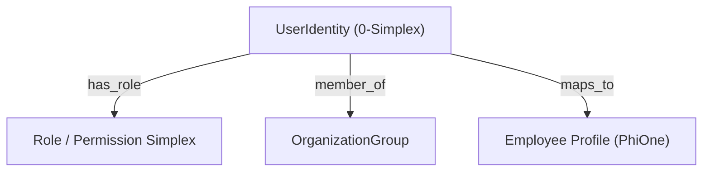

# Admin & Workforce Management (`Admin/UserAndWorkforce.md`)

- **Palantir Symmetry**: Maps to `foundry_sdk/v2/admin` (`User.md`, `Group.md`, `Role.md`, `Organization.md`).
- **Phient Subsystem**: [`src/phiadk/phione/`](./phient/src/phiadk/phione/) & [`src/phiadk/phigov/`](./phient/src/phiadk/phigov/).

---

## 1. Overview & Architecture

Phient provides workforce administration, Microsoft Entra SSO identity resolution, and role-based permissions modeled as **0-simplex vertices** (`UserIdentity`, `Employee`, `OrganizationGroup`) within the enterprise Topos.



---

## 2. Python SDK Usage

```python
from phiadk import PhiADKClient

client = PhiADKClient()

# 1. Lookup user in workforce
employee = client.phione.employee.get_employee_by_email("jane@phient.com")
print(f"Name: {employee['display_name']}, Department: {employee['department']}")

# 2. Check SSO Entra identity
identity = client.phione.identity.get_user("jane@phient.com")
print(f"Active Groups: {identity['groups']}")

# 3. Check leave balance
leave = client.phione.leave.get_leave_balance("jane@phient.com")
print(f"Vacation Days: {leave['vacation_days']}")
```
