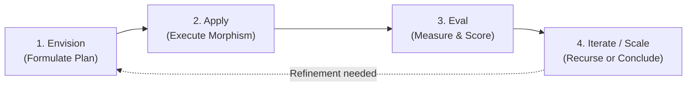

# AIP Agents & Universal Recursive Lifecycle (`AipAgents/RecursiveLifecycle.md`)

- **Palantir Symmetry**: Maps to `foundry_sdk/v2/aip_agents` (`Agent.md`, `AgentVersion.md`, `Session.md`, `SessionTrace.md`).
- **Phient Subsystem**: [`src/phiegg/_core/agent_base.py`](./phient/src/phiegg/_core/agent_base.py) & all 14 domain agents.

---

## 1. The 4-Phase Universal Recursive Lifecycle

Every domain agent in Phient extends `PhiAgent` / `PAgent` and executes through a strict 4-phase recursive lifecycle loop:



---

## 2. Python SDK Agent Execution

```python
import asyncio
from phiegg import PhiEggClient
from phiegg._core import AgentContext

client = PhiEggClient()
agent = client.agents["phione"]

async def run_agent():
    ctx = AgentContext(
        verb="lookup_employee",
        parameters={"email": "jane@phient.com"}
    )
    result_ctx = await agent.run(ctx)
    print("Plan:", result_ctx.results["plan"])
    print("Output:", result_ctx.results["output"])
    print("Confidence:", result_ctx.confidence)

asyncio.run(run_agent())
```
