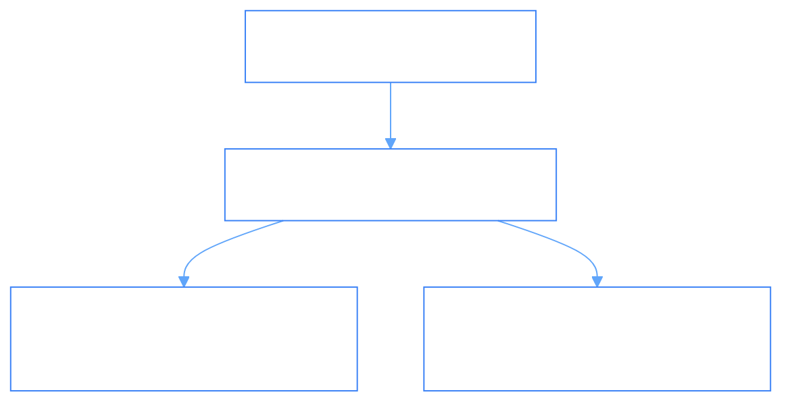

# Audit Trails & Telemetry Logging (`Audit/AuditTrails.md`)

- **Palantir Symmetry**: Maps to `foundry_sdk/v2/audit` (`LogFile.md`, `Organization.md`).
- **Phient Subsystem**: [`src/phiadk/philog/`](./phient/src/phiadk/philog/).

---

## 1. Cryptographic Audit Architecture

All telemetry and actions performed by agents or Topos mutations are logged into structured JSON records linked to immutable SHA-1 Git commit hashes.



---

## 2. Python SDK Usage

```python
from phiadk import PhiADKClient

client = PhiADKClient()

# Emit structured log
client.philog.info(
    "Executed salary update morphism",
    agent_id="phione",
    subject="jane@phient.com",
    commit_sha1="9d8c4f2a1b7e"
)

# Read recent telemetry tail
logs = client.philog.get_tail(n=5)
for log in logs:
    print(f"[{log.level}] {log.timestamp}: {log.message}")
```
