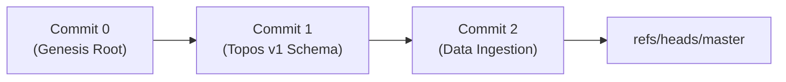

# State Snapshots & Checkpoints (`Checkpoints/StateSnapshots.md`)

- **Palantir Symmetry**: Maps to `foundry_sdk/v2/checkpoints` (`Record.md`).
- **Phient Subsystem**: [`src/phiegg/phigit/`](./phient/src/phiegg/phigit/).

---

## 1. Content-Addressed Git Checkpoints

State in Phient is checkpointed as SHA-1 Directed Acyclic Graph (DAG) commit objects. Every mutation creates an immutable tree snapshot that can be branched, audited, and rolled back.



---

## 2. Python SDK Usage

```python
from phiegg import PhiEggClient

client = PhiEggClient()

# Checkpoint a new state snapshot
blob = client.phigit.store_blob(b'{"state": "checkpoint_001"}')
tree = client.phigit.store_tree([{"mode": "100644", "path": "state.json", "sha1": blob.sha1}])
commit = client.phigit.commit(tree.sha1, message="checkpoint state", branch="master")

print(f"Checkpoint Commit SHA-1: {commit.sha1}")
```
