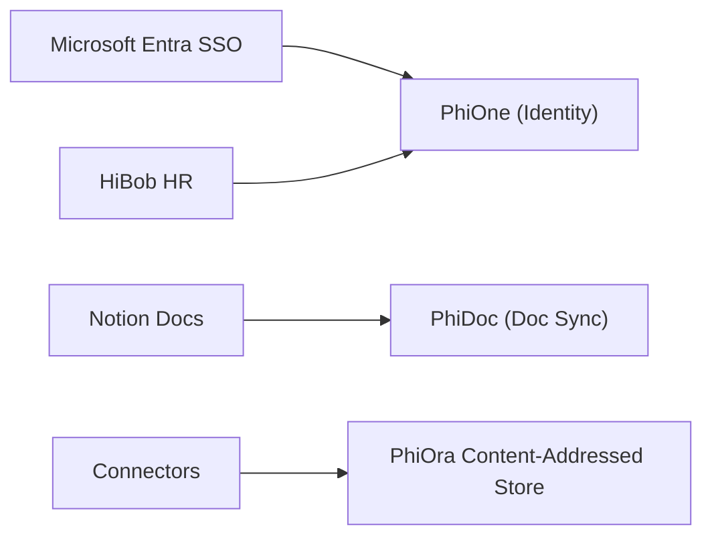

# Connectivity & External Integrations (`Connectivity/Connectors.md`)

- **Palantir Symmetry**: Maps to `foundry_sdk/v2/connectivity` (`Connection.md`, `FileImport.md`, `TableImport.md`, `VirtualTable.md`).
- **Phient Subsystem**: [`src/phiegg/phiora/`](./phient/src/phiegg/phiora/) & [`src/phiegg/phione/identity.py`](./phient/src/phiegg/phione/identity.py).

---

## 1. External System Connectors

Phient integrates with third-party enterprise providers via dedicated connectors:
- **Microsoft Entra ID / SSO**: User authentication and group synchronizations.
- **HiBob / BambooHR**: Workforce metadata and organizational hierarchy.
- **Notion / Confluence**: Workspace documentation synchronization.

