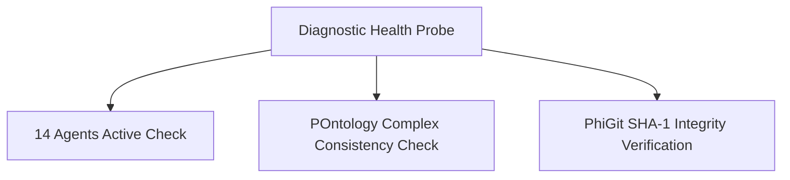

# Data Health & Diagnostics (`DataHealth/ProbesAndMetrics.md`)

- **Palantir Symmetry**: Maps to `foundry_sdk/v2/data_health` (`Check.md`, `CheckReport.md`).
- **Phient Subsystem**: [`src/phiadk/philog/`](./phient/src/phiadk/philog/) & [`src/phiadk/phiapi/app.py`](./phient/src/phiadk/phiapi/app.py).

---

## 1. System Health Probes

Phient continuously monitors agent health, API request latencies, and topological integrity.

---

## 2. API Endpoints

- `GET /healthz`: Basic liveness check.
- `GET /v2/telemetry/tail?n=50`: Live stream of latency probes and error reports.
