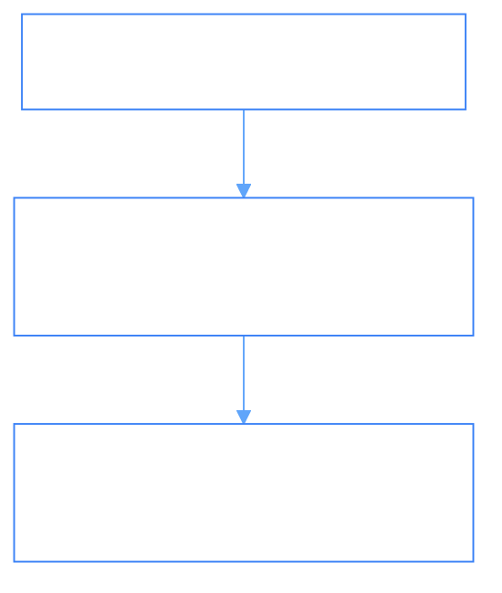

# Geo & High-Dimensional Geometric Spaces (`Geo/GeometricSpaces.md`)

- **Palantir Symmetry**: Maps to `foundry_sdk/v2/geo`.
- **Phient Subsystem**: [`src/phiadk/phical/semantic_search.py`](./phient/src/phiadk/phical/semantic_search.py) & [`src/phiadk/phiora/store.py`](./phient/src/phiadk/phiora/store.py).

---

## 1. High-Dimensional Geometric Manifolds

Entities in Phient are projected into high-dimensional geometric spaces where distances represent semantic, organizational, or geospatial proximity.



---

## 2. Python SDK Usage

```python
from phiadk import PhiADKClient

client = PhiADKClient()

# High-dimensional geometric search
results = client.phical.search.superposition_search(
    query="security compliance policy for data centers",
    top_k=3
)
for r in results:
    print(f"Vertex: {r['id']} | Amplitude: {r['amplitude']}")
```
