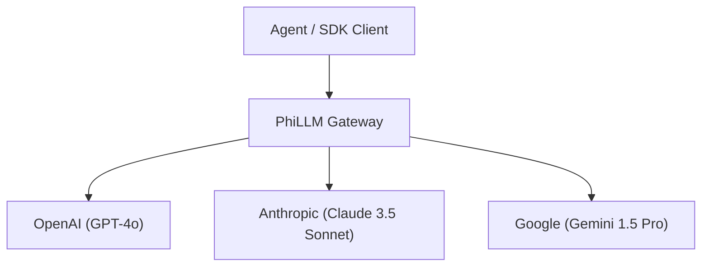

# Language Models Multi-Provider Gateway (`LanguageModels/GatewayAndStreaming.md`)

- **Palantir Symmetry**: Maps to `foundry_sdk/v2/language_models` (`OpenAiModel.md`, `AnthropicModel.md`).
- **Phient Subsystem**: [`src/phiadk/phillm/`](./phient/src/phiadk/phillm/).

---

## 1. Unified Multi-Provider LLM Gateway

Phient abstracts LLM providers (OpenAI, Anthropic Claude, Google Gemini) into a unified interface supporting streaming, structured JSON schemas, and fallback routing.



---

## 2. Python SDK Usage

```python
from phiadk import PhiADKClient

client = PhiADKClient()

# Generate completions across models seamlessly
res = client.phillm.generate(
    prompt="Explain topological manifolds concisely.",
    model="claude-3-5-sonnet"
)
print("Response:", res.text)
```
