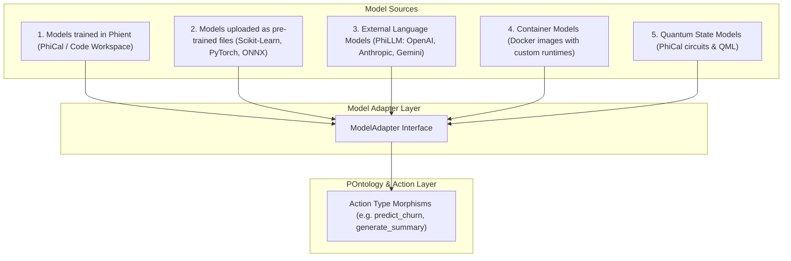

# Integrate Models Overview (v1)

Phient provides a unified, structure-preserving interface to integrate, train, evaluate, and serve machine learning and language models from diverse sources directly into the **POntology (Ontologylogical Ontology)**.

---

## 1. Supported Model Sources

Phient supports 5 primary model integration pathways:



1. **Models Trained in Phient (`phiadk.phical.training`)**: Supervised models and parameter gradient descent trained directly within the environment.
2. **Pre-trained Files Uploaded to Storage (`phiadk.phiora.store`)**: Weights serialized in `joblib`, `safetensors`, `onnx`, or `pt` uploaded with cryptographic SHA-1 tracking.
3. **Externally Hosted Models (`phiadk.phillm`)**: Multi-provider inference connecting to OpenAI (`gpt-4o`), Anthropic (`claude-3-5-sonnet`), and Google (`gemini-1.5-pro`).
4. **Container Models**: Custom Docker runtime containers with isolated dependencies.
5. **Quantum Models (`phiadk.query.qml`)**: Complex amplitude simulation and Born rule measurement circuits.

---

## 2. The ModelAdapter Interface

Every model in Phient is wrapped in a `ModelAdapter` that defines:
- **API Signature**: Expected input feature columns / prompt formats and output predictions.
- **Serialization**: Method to load/save weights to `PhiOra` content-addressed storage.
- **Inference (`predict`)**: Synchronous or streaming prediction logic.

```python
from phiadk import PhiADKClient

client = PhiADKClient()

# Execute an inference morphism directly through the POntology
result = client.topos.Action.apply("predict_employee_flight_risk", {
    "email": "jane.m@phient.com",
    "model": "risk_classifier_v1"
})
```

---

## 3. Modeling Objectives & Evaluations

Models are benchmarked against **Modeling Objectives** managed by `PhiMen` (Executive Agent):
- **Candidate Models**: Multiple model versions trained across experiments.
- **Evaluation Metrics**: Precision, Recall, F1-Score, Latency (ms), and Token Cost.
- **Release Lineage**: Promoting a candidate to the active POntology production Action.
