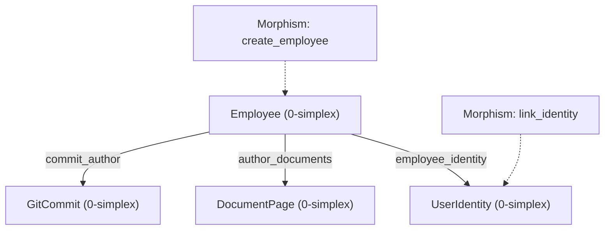

# POntology: POntologyEngine & Simplicial Complex (v2)

The **POntologyEngine** is the central simplicial registry managing vertices (Object Types), edges (Link Types), and morphisms (Action Types) across all enterprise domains.

## 1. Simplicial Complex Schema

```python
from phiegg.ontologies import POntologyEngine, ObjectType, LinkType, ActionType


engine = POntologyEngine()

# Introspect schema
schema = engine.to_dict()

# Export Mermaid simplicial complex diagram
mermaid_code = engine.to_mermaid()
print(mermaid_code)
```

## 2. Mermaid Diagram Example


