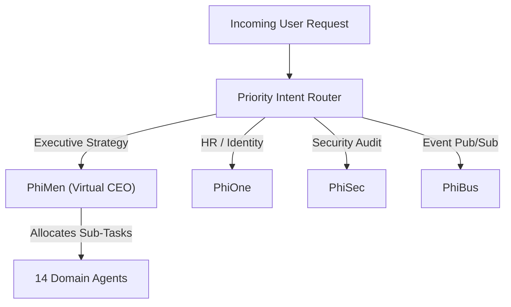

# Orchestration, Intent Routing & Virtual CEO (`Orchestration/VirtualCeoAndRouting.md`)

- **Palantir Symmetry**: Maps to `foundry_sdk/v2/orchestration` (`Build.md`, `Job.md`, `Schedule.md`).
- **Phient Subsystem**: [`src/phiadk/phimen/`](./phient/src/phiadk/phimen/) & [`src/orchestrator/`](./phient/src/orchestrator/).

---

## 1. Multi-Tier Intent Routing & Executive Orchestration

Queries and high-level enterprise directives pass through the LangGraph Intent Router to the **Virtual CEO (PhiMen)** for multi-domain coordination:



---

## 2. Python SDK Usage

```python
from phiadk import PhiADKClient

client = PhiADKClient()

# Execute high-level strategic directive
decision = client.phimen.orchestrate_strategy(
    objective="Audit enterprise access tokens and prepare GDPR report",
    required_domains=["phisec", "phigov"]
)
print("Strategic Decision:", decision["decision"])
```
