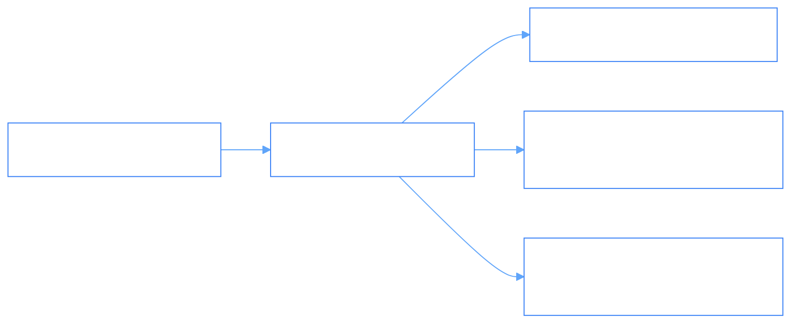

# Event Streams & PhiBus Pub/Sub (`Streams/PubSubEventStreams.md`)

- **Palantir Symmetry**: Maps to `foundry_sdk/v2/streams` (`Stream.md`, `Subscriber.md`).
- **Phient Subsystem**: [`src/phiadk/phibus/`](./phient/src/phiadk/phibus/).

---

## 1. Pure Pub/Sub Streams with PBusEvent

`PhiBus` provides high-throughput asynchronous event streaming with topic filtering and wildcard subscriptions.



---

## 2. Python SDK Usage

```python
from phiadk import PhiADKClient
from phiadk.phibus import PBusEvent

client = PhiADKClient()

# Subscribe
client.phibus.sub("topos.mutation", lambda evt: print(f"Mutation: {evt.payload}"))

# Publish
client.phibus.pub("topos.mutation", PBusEvent(
    topic="topos.mutation",
    payload={"object_type": "Employee", "action": "update_title"},
    source_agent="phione"
))
```
