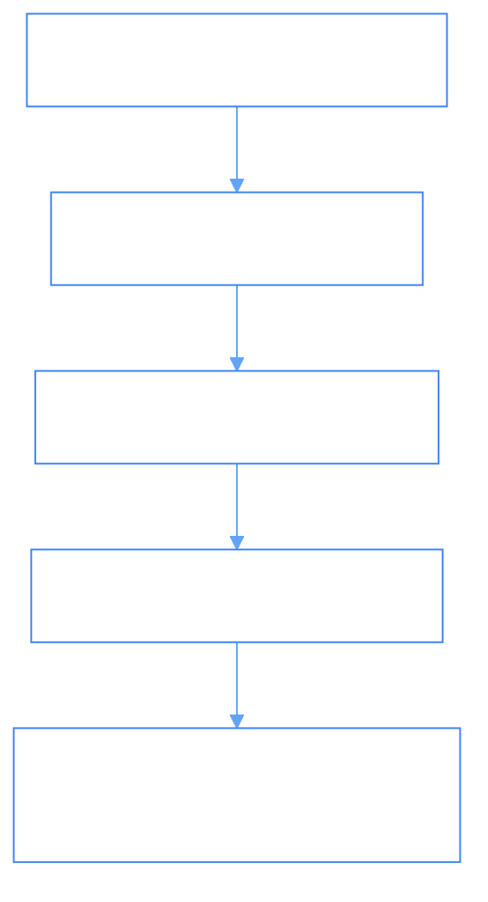

# Third-Party Applications & Automation Playbooks (`ThirdPartyApplications/AutomationPlaybooks.md`)

- **Palantir Symmetry**: Maps to `foundry_sdk/v2/third_party_applications` (`ThirdPartyApplication.md`, `Website.md`).
- **Phient Subsystem**: [`src/phiadk/phibot/`](./phient/src/phiadk/phibot/).

---

## 1. Automation DAG Playbooks & Webhooks

External systems interact with Phient via scheduled DAG playbooks and incoming/outgoing webhooks.

