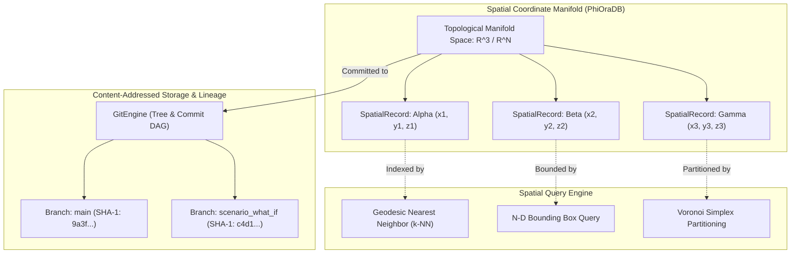
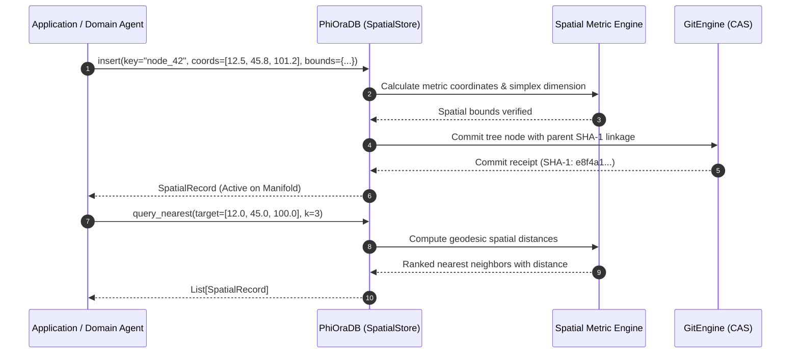
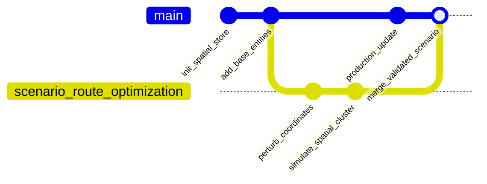

# PhiOraDB: Topological Spatial Store Engine (`docs/v2/Datasets/PhiOraDB.md`)

`PhiOraDB` is the first-class **Spatial Store** of the Phient / PhiADK ecosystem. 

Unlike raw, generic vector flat tables (which only store unstructured float arrays with no coordinate geometry), `PhiOraDB` operates as a true **Topological Spatial Store**:
1. **N-Dimensional Spatial Manifolds**: Entities possess Riemannian/Euclidean spatial coordinates ($R^2, R^3, R^N$), spatial bounding envelopes, simplex dimensions, and geodesic metrics.
2. **Content-Addressed Immutability**: Every spatial state transition is hashed using SHA-1 and stored in an immutable Git DAG backed by `GitEngine`.
3. **Topological Nearest Neighbor & Range Queries**: Enables geodesic $k$-nearest spatial neighbor search, multi-dimensional bounding-box containment, and Voronoi cell partitioning.
4. **Dataset Branching**: Enables zero-copy copy-on-write branching (`main`, `scenario_branch`, `staging`) of spatial datasets.

---

## 1. Architectural Overview & Mermaid Diagram



---

## 2. Spatial Store vs. Raw Vector Store

| Feature | Raw Vector Index (e.g. FAISS/Chroma) | **PhiOraDB Spatial Store** |
| :--- | :--- | :--- |
| **Data Primitive** | Unstructured 1D float array | **`SpatialRecord` with N-D Coordinates & Manifold Metric** |
| **Geometry Support** | None (Cosine similarity only) | **Bounding Envelopes, Voronoi Simplexes, Geodesics** |
| **Immutability & History** | Overwrite in place (destructive) | **Git-backed Content-Addressed SHA-1 DAG Lineage** |
| **Branching Support** | No branching (single state) | **Zero-Copy What-If Scenario Branching** |
| **Ontology Integration** | Loose external service | **Direct 1:1 binding to `POntologyEngine` Object Types** |

---

## 3. Spatial Store Data Flow Diagram



---

## 4. Python SDK Usage Example

```python
from phiadk.agents.phiora import PhiOraDB, SpatialStore

# 1. Initialize PhiOraDB Spatial Store on Euclidean R^3 manifold
db = PhiOraDB(manifold="euclidean_r3")

# 2. Insert Spatial Entities
db.insert(
    key="radar_node_01",
    coordinates=[10.5, 20.2, 5.0],
    data={"station": "North Hub", "status": "ACTIVE"},
    spatial_bounds={"min_x": 10.0, "max_x": 11.0, "min_y": 20.0, "max_y": 21.0},
)

db.insert(
    key="radar_node_02",
    coordinates=[12.0, 22.5, 6.1],
    data={"station": "East Hub", "status": "ACTIVE"},
)

# 3. Perform Nearest Spatial Geodesic Query
neighbors = db.query_nearest(target_coords=[10.0, 20.0, 5.0], k=2)
for n in neighbors:
    print(f"Key: {n['key']}, Distance: {n['distance']}, Data: {n['data']}")

# 4. Perform Multi-Dimensional Bounding Box Query
box_matches = db.query_bounding_box(
    min_coords=[9.0, 19.0, 0.0],
    max_coords=[15.0, 25.0, 10.0],
)
print(f"Entities in Bounding Box: {len(box_matches)}")
```

---

## 5. Branching & What-If Scenario Simulation


