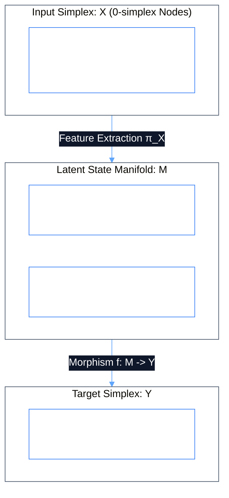

# Integrate Models Overview: Topological & Quantum Architecture (v2)

In Phient v2, models are treated as **Continuous State Manifolds and Morphism Bundles**. Rather than isolated black boxes, models are bound directly to 0-simplex Object Types and executed via structure-preserving state morphisms.

---

## 1. Topological Model Integration Architecture



---

## 2. Model Training in Jupyter Code Workspaces

Models can be developed and evaluated interactively in Jupyter Code Workspaces (`src/phiadk/phiapi/dashboard.html`):

```python
# Jupyter %%sql + Model Adapter Pipeline
%%sql -o df
SELECT email, department, leave_taken, tenure_months FROM employee_records WHERE status = 'active';

from phiadk import PhiADKClient
from sklearn.ensemble import GradientBoostingClassifier

client = PhiADKClient()

# Train model over resolved dataset
X = df[['leave_taken', 'tenure_months']]
y = df['flight_risk']

clf = GradientBoostingClassifier()
clf.fit(X, y)

# Snapshot weights to PhiGit content-addressed storage
rec = client.phiora.Store.put("models", "flight_risk_gbc", clf, message="Trained flight risk GBC v2")
print(f"Model commit: {rec._commit_sha1}")
```

---

## 3. Quantum Model Integration via QML

For quantum state modeling, Phient allows embedding quantum circuit models directly into RAG and classification pipelines:

```python
from phiadk import PhiADKClient

client = PhiADKClient()

# Execute quantum classification circuit
quantum_pred = (
    client.qml("classifier_circuit")
    .superposition(["|00⟩", "|01⟩", "|10⟩", "|11⟩"])
    .apply_gate("H", qubit=0)
    .entangle(0, 1)
    .decoherence_filter(threshold=0.15)
    .born_measurement(threshold=0.05)
    .execute()
)

print(quantum_pred.probabilities)
```

---

## 4. Lifecycle & Governance

| Stage | Phient Agent / Module | Responsibility |
| :--- | :--- | :--- |
| **Development** | `PhiCal` / Jupyter Code Workspace | Circuit design, feature engineering, and training. |
| **Storage & Versioning** | `PhiGit` / `PhiOra` | Immutable cryptographic SHA-1 weight storage and parent lineage. |
| **Evaluation & Benchmarks** | `PhiMen` | Modeling Objectives, loss surface evaluation, and latency tests. |
| **Deployment to Topos** | `ToposEngine` (`ActionType`) | Exposing model as a typed, validated action morphism. |
| **Telemetry & Auditing** | `PhiLog` | Real-time SSE execution logs, token usage, and audit records. |
