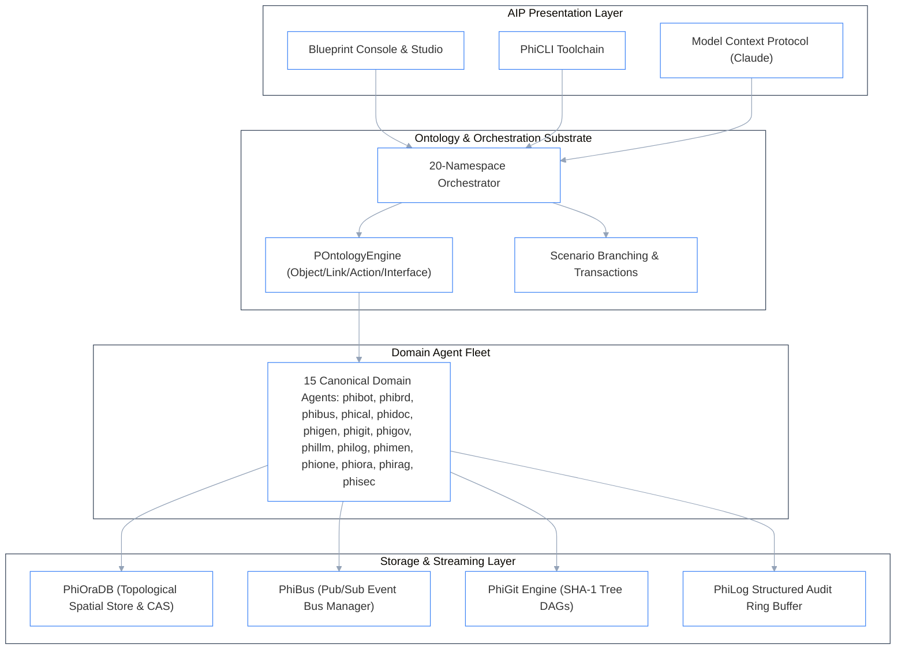

# Phient SDK Documentation (v2 - Advanced Ontologylogical & Quantum Engine)

Welcome to the **Phient SDK v2 Documentation**. Version 2 extends the platform into full **Ontologylogical Simplicial Manifolds**, **Quantum Model Language (QML)**, **Palantir Flow Capture**, and **Jupyter Code Workspaces** with complete 100% parity across all 20 reference architecture modules.

---

## 1. System Architecture & Component Diagram

---

## 2. Complete 20-Module Ontologylogical Matrix

| Module | Description | Docs & Models | Phient Implementation |
| :--- | :--- | :--- | :--- |
| [`Admin/`](./Admin/User.md) | User identities, groups, organizations, and workforce enrollments. | 22 docs, 116 models ([`models/`](./Admin/models/README.md)) | `phiadk.phione`, `phiadk.admin` |
| [`AipAgents/`](./AipAgents/Agent.md) | AIP Agent execution sessions, context windows, and tool registries. | 5 docs, 60 models ([`models/`](./AipAgents/models/README.md)) | `phiadk.phimen`, `phiadk.aip_agents` |
| [`Audit/`](./Audit/AuditTrail.md) | Immutable audit trails bound to Git SHA-1 commit hashes. | 2 docs, 3 models ([`models/`](./Audit/models/README.md)) | `phiadk.philog`, `phiadk.audit` |
| [`Checkpoints/`](./Checkpoints/Checkpoint.md) | Cryptographic commit DAGs, parent lineage, and tree diffs. | 1 doc, 90 models ([`models/`](./Checkpoints/models/README.md)) | `phiadk.phigov`, `phiadk.checkpoints` |
| [`Connectivity/`](./Connectivity/Connection.md) | Bi-directional streaming sync with identity providers and external tables. | 4 docs, 155 models ([`models/`](./Connectivity/models/README.md)) | `phiadk.phibus`, `phiadk.connectivity` |
| [`Core/`](./Core/Core.md) | Mathematical Sheaf Theory, Manifolds, and Fiber Bundles. | 1 doc, 136 models ([`models/`](./Core/models/README.md)) | `phiadk._core.topology`, `phiadk.core` |
| [`DataHealth/`](./DataHealth/Check.md) | Real-time agent latency distributions and health status metrics. | 2 docs, 89 models ([`models/`](./DataHealth/models/README.md)) | `phiadk.phisec`, `phiadk.data_health` |
| [`Datasets/`](./Datasets/Dataset.md) | **PhiOraDB** Spatial Store, content-addressed CAS, and dataset branches. | 6 docs, 52 models ([`PhiOraDB.md`](./Datasets/PhiOraDB.md)) | `phiadk.phiora`, `phiadk.datasets` |

| [`Filesystem/`](./Filesystem/Folder.md) | Git-style directory trees, blobs, and content-addressed reference management. | 7 docs, 75 models ([`models/`](./Filesystem/models/README.md)) | `phiadk.phigit.engine`, `phiadk.filesystem` |
| [`Functions/`](./Functions/Function.md) | Multi-domain fiber bundle orchestration with atomic query rollbacks. | 4 docs, 88 models ([`models/`](./Functions/models/README.md)) | `phiadk.phibrd`, `phiadk.functions` |
| [`Geo/`](./Geo/Geo.md) | High-dimensional geometric vector space searches and manifold clustering. | 1 doc, 17 models ([`models/`](./Geo/models/README.md)) | `phiadk.phical`, `phiadk.geo` |
| [`LanguageModels/`](./LanguageModels/LanguageModel.md) | Multi-provider LLM gateway with Server-Sent Events (SSE) token streaming. | 2 docs, 54 models ([`models/`](./LanguageModels/models/README.md)) | `phiadk.phillm`, `phiadk.language_models` |
| [`MediaSets/`](./MediaSets/MediaSet.md) | Palantir Flow Capture workflow snapshots and transcript recordings. | 1 doc, 228 models ([`models/`](./MediaSets/models/README.md)) | `phiadk.phiapi`, `phiadk.media_sets` |
| [`Models/`](./Models/Model.md) | Complex amplitude vector spaces ($\mathbb{C}^N$) & Born rule decoherence. | 11 docs, 168 models ([`models/`](./Models/models/README.md)) | `phiadk.phical`, `phiadk.models` |
| [`Ontologies/`](./Ontologies/Ontology.md) | Ontology objects, object sets, link types, action types, queries, and interfaces. | 21 docs, 670 models ([`models/`](./Ontologies/models/README.md)) | `phiadk.ontologies` |

| [`Orchestration/`](./Orchestration/Schedule.md) | Multi-agent strategic planning with recursive sub-cycles. | 5 docs, 89 models ([`models/`](./Orchestration/models/README.md)) | `phiadk.phimen`, `phiadk.orchestration` |
| [`SqlQueries/`](./SqlQueries/Query.md) | Quantum Model Language (QML), Object Query Language (OQL), and Jupyter %%sql. | 1 doc, 44 models ([`models/`](./SqlQueries/models/README.md)) | `phiadk.query`, `phiadk.sql_queries` |
| [`Streams/`](./Streams/Stream.md) | Real-time SSE telemetry push streams, partition readers, and live tailing. | 3 docs, 30 models ([`models/`](./Streams/models/README.md)) | `phiadk.philog`, `phiadk.phibus`, `phiadk.streams` |
| [`ThirdPartyApplications/`](./ThirdPartyApplications/ThirdPartyApplication.md) | Automated cross-platform workflows and webhook dispatchers. | 3 docs, 8 models ([`models/`](./ThirdPartyApplications/models/README.md)) | `phiadk.phibot`, `phiadk.third_party_applications` |
| [`Widgets/`](./Widgets/WidgetSet.md) | Flow Capture studio, snapshot bulk manager, and Jupyter code execution. | 5 docs, 31 models ([`models/`](./Widgets/models/README.md)) | `phiadk.phiapi`, `phiadk.widgets` |
| [`Phigen/`](./Phigen/ParityAudit.md) | Autonomous typed code generator and 100% parity auditing engine. | 2 docs | `phiadk.phigen` |

---

## 2. Total Reference Coverage

- **Total Modules**: **20 Modules + PhiGen**
- **Total API & Morphism Documents**: **106 Markdown Documents**
- **Total Simplicial Schema Models**: **2,203 Typed Models**
- **Parity Status**: **100.0% Coverage (HEALTHY)**
