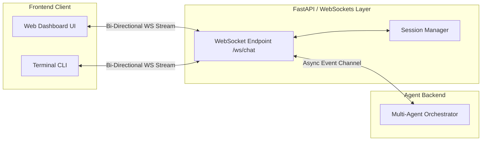
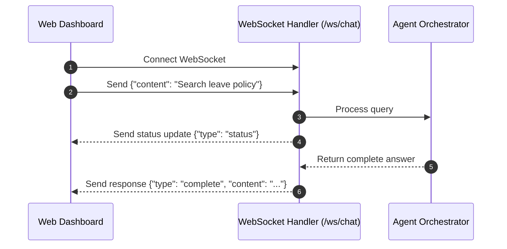

# Dependency Documentation: websockets

## 1. Overview
- **Package**: `websockets`
- **Version Constraint**: `>=13.0`
- **Category**: Real-Time Communication Protocol
- **Primary Modules**: `src/api/main.py`

## 2. What It Does
`websockets` provides WebSocket server and client protocol support in Python, enabling real-time, bi-directional streaming between the server and Web Dashboard or CLI.

## 3. Why It Was Chosen
1. **Live Token Streaming**: Allows streaming agent responses token-by-token as Claude generates text.
2. **Low Overhead**: Minimal latency protocol overhead for live status updates.

## 4. Architectural & System Flow Diagrams

### Topology & Channel Architecture


### Communication Sequence Diagram


## 5. Alternatives Comparison

| Feature | websockets | Socket.IO | Server-Sent Events (SSE) |
|---------|------------|-----------|--------------------------|
| Protocol | Native WebSocket (RFC 6455) | Custom Protocol Layer | HTTP Streaming |
| Direction | Bi-directional | Bi-directional | Uni-directional (Server to Client) |
| Selection Rationale | Standard bi-directional streaming protocol | Heavy client library required | WebSockets preferred for interactive chat |

## 6. Code Usage Example

```python
from fastapi import WebSocket

@app.websocket("/ws/chat")
async def websocket_endpoint(websocket: WebSocket):
    await websocket.accept()
    data = await websocket.receive_json()
    await websocket.send_json({"type": "status", "content": "Processing..."})
```
