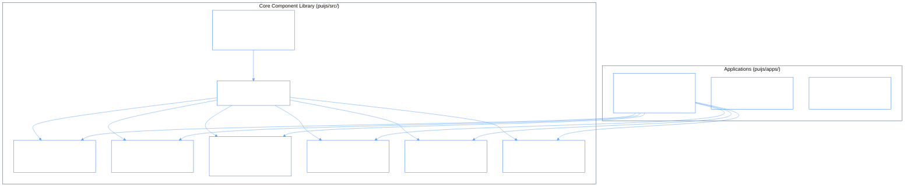

# puijs (`puijs`)

> _Enterprise React Component Library & Design System modeled after **Palantir Blueprint** (`@blueprintjs/core`, `@blueprintjs/table`, `@blueprintjs/icons`)._

[](https://www.npmjs.com/package/puijs)
[](package.json)
[](ARCHITECTURE.md)
[](LICENSE)

---

## 1. Design Philosophy & Decoupled Architecture

`puijs` is an industrial-grade component library specifically tailored for dense data interfaces, AI agent dashboards, knowledge graphs, and complex enterprise web applications:

- **Palantir Blueprint Parity**: Pure composable UI building blocks (`Tree`, `Table`, `Card`, `Button`, `Callout`, `Tag`, `Dialog`, `Drawer`, `Toast`, `Tabs`, `Navbar`, `Menu`, `NonIdealState`, `Switch`, `Slider`, `FormGroup`).
- **Strict Separation of Concerns**: Zero business logic, zero domain carts, zero mock store services in the core library. Props flow down; callbacks flow up.
- **Multi-Brand Theming**: Built-in Foundry Blue, Blueprint Slate, Emerald, Midnight, and Amber palettes with instant light/dark mode and flat/elevated/glass surface styles.
- **Dedicated Interactive Workbench (`apps/pui-book` / `puijs.com`)**: Replaces heavy third-party storybooks with our own lightweight, full-featured live documentation and component playground.



---

## 2. Quick Start

### Installation via NPM

```bash
npm install puijs lucide-react
```

### 1. Import Core Styles in Your Root Layout

```tsx
import 'puijs/styles';
import 'puijs/tokens';
```

### 2. Wrap with the Theme Provider

```tsx
import { PuiProvider } from 'puijs';

export default function RootLayout({ children }: { children: React.ReactNode }) {
  return (
    <PuiProvider defaultTheme="system" defaultBrand="foundry">
      {children}
    </PuiProvider>
  );
}
```

### 3. Use Components

```tsx
import { Button, Tag, Callout, Tree, Stack, Card } from 'puijs';

export const AgentStatus = () => (
  <Card elevation={1}>
    <Stack direction="row" justify="between" align="center">
      <Tag intent="success" round>Agent: Synchronized</Tag>
      <Button variant="primary" size="sm">Inspect</Button>
    </Stack>
    <Callout intent="primary" title="Phase Manifold">
      Kuramoto order parameter reached resonance r = 0.984.
    </Callout>
  </Card>
);
```

---

## 3. Applications & Demos

`puijs` includes three dedicated applications in [`apps/`](apps/):

- **[`apps/pui-book`](apps/pui-book/)** (`puijs.com`): Interactive component catalog, live prop inspector, and code examples.
- **[`apps/demo-app`](apps/demo-app/)**: Full enterprise operational dashboard with live ontology trees, data tables, and telemetry drawers.
- **[`apps/landing-app`](apps/landing-app/)**: Design system landing page and feature tour.

---

## 4. Documentation

- **[`ARCHITECTURE.md`](ARCHITECTURE.md)** — Architectural design, token system, and package boundaries.
- **[`COMPONENTS.md`](COMPONENTS.md)** — Complete component catalog & API specification.
- **[`ROADMAP.md`](ROADMAP.md)** — Component rollout milestones and future extensions.
- **[`apps/README.md`](apps/README.md)** — Application catalog & execution guides.

---

## License

MIT © [GemPhi](https://github.com/gemphi)
