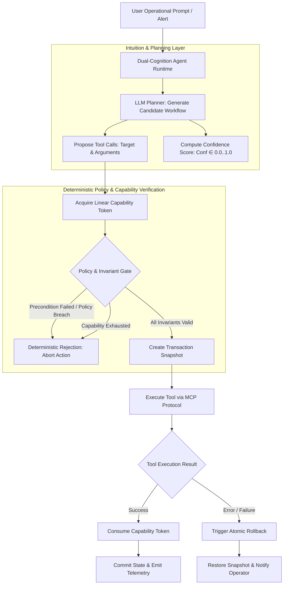

# SPEC-001: Dual-Cognition Agent Runtime (Neural Intuition + Policy Verification)

## 1. Executive Summary & Theoretical Grounding

> **Deep Learning Concept Reference (Chollet DL Book §14.4)**:
> *"Intelligence requires two complementary modes of abstraction: (1) Value-centric analogy (continuous similarity, perception, intuition) to explore large search spaces and generate candidate plans; and (2) Program-centric analogy (exact discrete structure, formal reasoning, rules) to prove correctness, enforce safety bounds, and guarantee non-reentrancy."*

Phient unifies continuous LLM planning intuition with deterministic LangGraph state machine policies and Move-style linear execution capabilities.

---

## 2. Architectural Hierarchy Tree

```
phient::runtime / phient::graph
├── Value-Centric Intuition Subsystem (LLM Planning)
│   ├── Chain-of-Thought Plan Generator (Anthropic Claude / OpenAI / Local Models)
│   ├── Context & Memory Synthesizer: Summarizes multi-turn interaction history
│   ├── Tool Call Intent Proposer: Generates candidate tool arguments and targets
│   └── Plan Confidence Estimator: Probabilistic score over proposed execution path
├── Program-Centric Symbolic Verification Subsystem (Deterministic Policies)
│   ├── Move-Style Linear Capability Tokens
│   │   ├── Single-Use Action Token: LinearCapability (cannot be duplicated)
│   │   ├── Token Consumption Guard: consume() destroys token on dispatch
│   │   └── Scope Partitioning: Scopes capabilities to specific cloud resources
│   ├── Pre-Execution Policy Validator (Role-based boundaries, budget caps)
│   ├── Pre-Execution Invariant Proofs (State precondition checks)
│   └── Post-Execution Invariant Proofs (State postcondition checks)
└── Execution Arbiter & Atomic Transaction Manager
    ├── Transaction Snapshot Creator (Captures rollback state before action)
    ├── Atomic Execution Dispatcher
    └── Rollback Compensator (Executes inverse actions on execution failure)
```

---

## 3. Component Interaction & Execution Flow



---

## 4. Technical Specification & Data Structures

### 4.1 Dual-Cognition Agent Subsystem Division

| Property | Value-Centric Intuition Layer | Program-Centric Policy Layer |
| :--- | :--- | :--- |
| **Technology** | Anthropic Claude / LangChain / ChromaDB | LangGraph / Pydantic / Move Capability Tokens |
| **Domain** | Semantic Natural Language & Probabilities | Discrete State Graphs & Boolean Predicates |
| **Primary Strength** | Creative problem solving, intent parsing | Zero-hallucination, strict safety guarantees |
| **Failure Mode Addressed**| Hallucinations, unbounded tool invocation | Brittle rigidness under novel inputs |
| **Output Type** | `ProposedActionPlan` | `Result<ValidatedExecution, PolicyRejection>` |

### 4.2 Linear Capability Token Semantics
In Python, capability tokens are managed via linear single-use context wrappers:
```python
class LinearCapabilityToken:
    def __init__(self, capability_name: str, allowed_targets: list[str]):
        self.name = capability_name
        self.allowed_targets = allowed_targets
        self._consumed = False

    def consume(self, target: str) -> None:
        if self._consumed:
            raise CapabilityExhaustedError("Capability token already consumed!")
        if target not in self.allowed_targets:
            raise UnauthorizedTargetError(f"Target {target} not authorized for {self.name}")
        self._consumed = True
```

---

## 5. Python Implementation Signatures

```python
from typing import Any, Dict, List, Optional
from pydantic import BaseModel, Field

class ProposedAction(BaseModel):
    tool_name: str
    arguments: Dict[str, Any]
    confidence_score: float = Field(ge=0.0, le=1.0)
    rationale: str

class ExecutionProof(BaseModel):
    policy_verified: bool
    capability_consumed: str
    precondition_check: bool
    postcondition_check: bool
    timestamp_ns: int

class DualCognitionAgent:
    def __init__(self, llm_client: Any, policy_graph: Any):
        self.llm = llm_client
        self.graph = policy_graph

    async def plan_and_verify(
        self,
        prompt: str,
        capabilities: List[LinearCapabilityToken],
    ) -> ValidatedActionPlan:
        ...

    async def execute_atomic(
        self,
        plan: ValidatedActionPlan,
    ) -> ExecutionResult:
        ...
```

---

## 6. Verification & Test Criteria

1. **Double-Execution Prevention**: Attempting to execute an action twice with the same capability token must raise `CapabilityExhaustedError` on the second attempt.
2. **Policy Invariant Gate**: If an action attempts to modify an unauthorized cloud cluster, the policy verifier must reject the operation with an explicit violation proof.
3. **Atomic Rollback Verification**: Simulating an injected tool crash during a multi-step workflow must execute compensating actions, returning system state to the pre-execution baseline.
