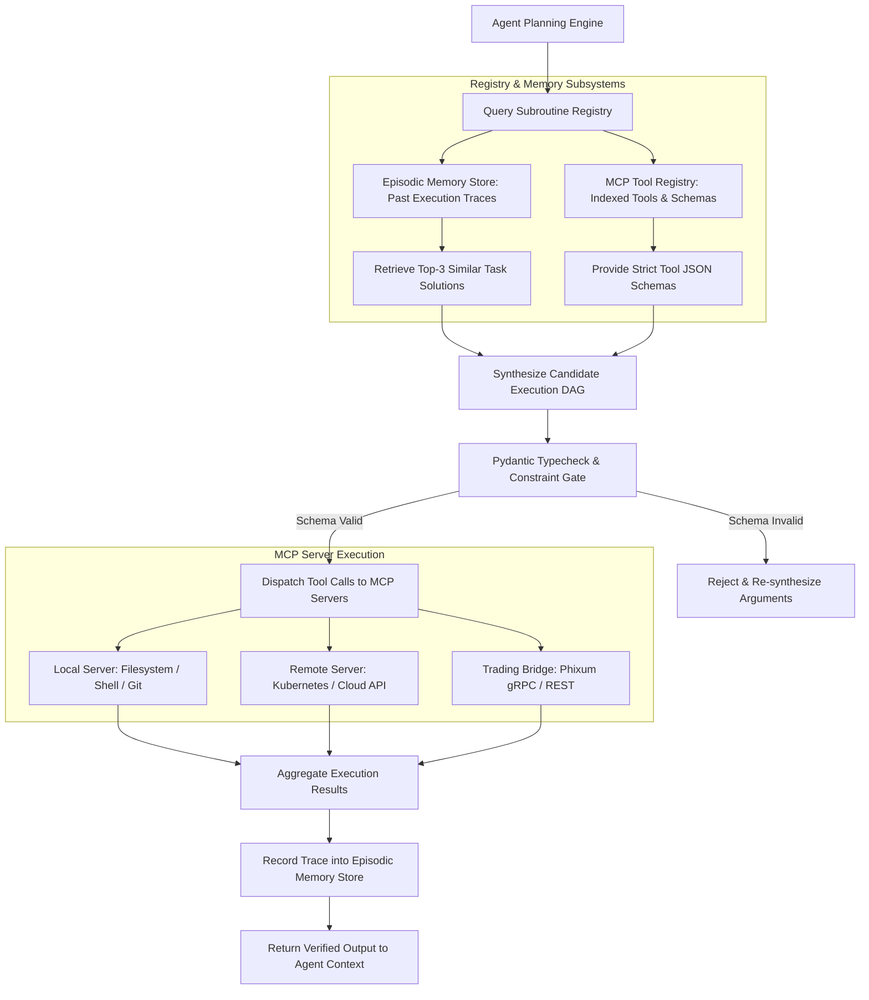

# SPEC-002: Modular MCP Tool Registry & Lifelong Subroutine Reuse

## 1. Executive Summary & Theoretical Grounding

> **Deep Learning Concept Reference (Chollet DL Book §14.5B)**:
> *"A central theme for the future of AI is lifelong modular subroutine reuse. Systems should not learn every task in isolation; they must accumulate a registry of verified, reusable subroutines that can be composed and synthesized into higher-level programs."*

Phient implements a **Model Context Protocol (MCP) Subroutine Registry** that dynamically discovers, verifies, and indexes local and remote operational tools.

---

## 2. Architectural Hierarchy Tree

```
phient::tools / phient::mcp
├── Modular MCP Subroutine Registry
│   ├── MCP Server Discovery Engine (Stdio & SSE Transports)
│   ├── Tool Metadata Indexer (Names, Schemas, Input Constraints, Descriptions)
│   ├── Tool Health & Latency Monitor (Periodic ping & circuit breaking)
│   └── Composable Pipeline DAG Builder (Chains tools into deterministic workflows)
├── Lifelong Episodic Memory Replay Buffer
│   ├── Episodic Memory Store (ChromaDB / SQLite Backend)
│   ├── Execution Trace Indexer: (Prompt, ToolChain, Invariants, SuccessBoolean)
│   ├── Few-Shot Tool Synthesis Prompt Generator (Injects top-k past success traces)
│   └── Subroutine Performance Metrics (Tracks execution success rates over time)
└── Tool Parameter Synthesizer & Schema Typechecker
    ├── Pydantic V2 Dynamic Schema Validator
    ├── Type Coercion Guard (Blocks unsafe string-to-code conversions)
    └── Bounded Parameter Value Assertions
```

---

## 3. Component Interaction & Execution Flow



---

## 4. Technical Specification & Data Structures

### 4.1 MCP Subroutine Registry Taxonomy

| Subroutine Category | Tool Name | Transport | Input Schema | Output Schema | Reusability |
| :--- | :--- | :--- | :--- | :--- | :--- |
| **System** | `fs_read_write` | `stdio` | `Path, Content, Mode` | `Result<FileContent, IoError>` | Global |
| **System** | `shell_command` | `stdio` | `Command, Timeout, Cwd` | `ExitCode, Stdout, Stderr` | Global |
| **Cloud Ops** | `k8s_deploy_inspect`| `sse` | `Cluster, Namespace, Resource`| `PodStatus, Logs, Events` | Reusable across envs |
| **Trading Bridge**| `phixum_risk_query`| `grpc` | `Account, Asset, Horizon` | `PortfolioGreeks, Margin` | Reusable across strategies |
| **Diagnostic** | `latency_benchmark`| `stdio` | `TargetEndpoint, Iterations` | `p50, p90, p99 Latency` | Reusable across services |

---

## 5. Python Implementation Signatures

```python
from typing import Any, Callable, Dict, List, Optional
from pydantic import BaseModel, Field

class ToolMetadata(BaseModel):
    name: str
    description: str
    input_schema: Dict[str, Any]
    transport: str # "stdio" | "sse" | "grpc"
    server_id: str
    success_rate: float = Field(default=1.0, ge=0.0, le=1.0)
    avg_latency_ms: float = 0.0

class EpisodicTrace(BaseModel):
    task_description: str
    tool_sequence: List[str]
    input_parameters: List[Dict[str, Any]]
    success: bool
    execution_time_ms: float
    timestamp: int

class McpSubroutineRegistry:
    def __init__(self, storage_path: str):
        self.tools: Dict[str, ToolMetadata] = {}
        self.episodic_traces: List[EpisodicTrace] = []

    def register_tool(self, metadata: ToolMetadata) -> None:
        self.tools[metadata.name] = metadata

    def get_tool(self, name: str) -> Optional[ToolMetadata]:
        return self.tools.get(name)

    def retrieve_similar_traces(self, task: str, top_k: int = 3) -> List[EpisodicTrace]:
        ...

    def record_trace(self, trace: EpisodicTrace) -> None:
        self.episodic_traces.append(trace)

    async def execute_tool(self, name: str, arguments: Dict[str, Any]) -> Dict[str, Any]:
        ...
```

---

## 6. Verification & Test Criteria

1. **MCP Dynamic Discovery**: Spawning a local MCP server over `stdio` must populate the registry and make its tool schemas accessible to the LLM within $<500\text{ms}$.
2. **Schema Typecheck Gate**: Passing invalid parameter types (e.g. integer instead of string path) must be intercepted by Pydantic before socket dispatch.
3. **Episodic Memory Retrieval Accuracy**: Querying the memory store with a paraphrase of a previously solved operational task must return the verified tool sequence with cosine similarity $>0.85$.
4. **Resilience Under Server Disconnection**: If an MCP server crashes during tool execution, the registry must mark the server as unhealthy, abort the call gracefully, and prevent deadlocks.
