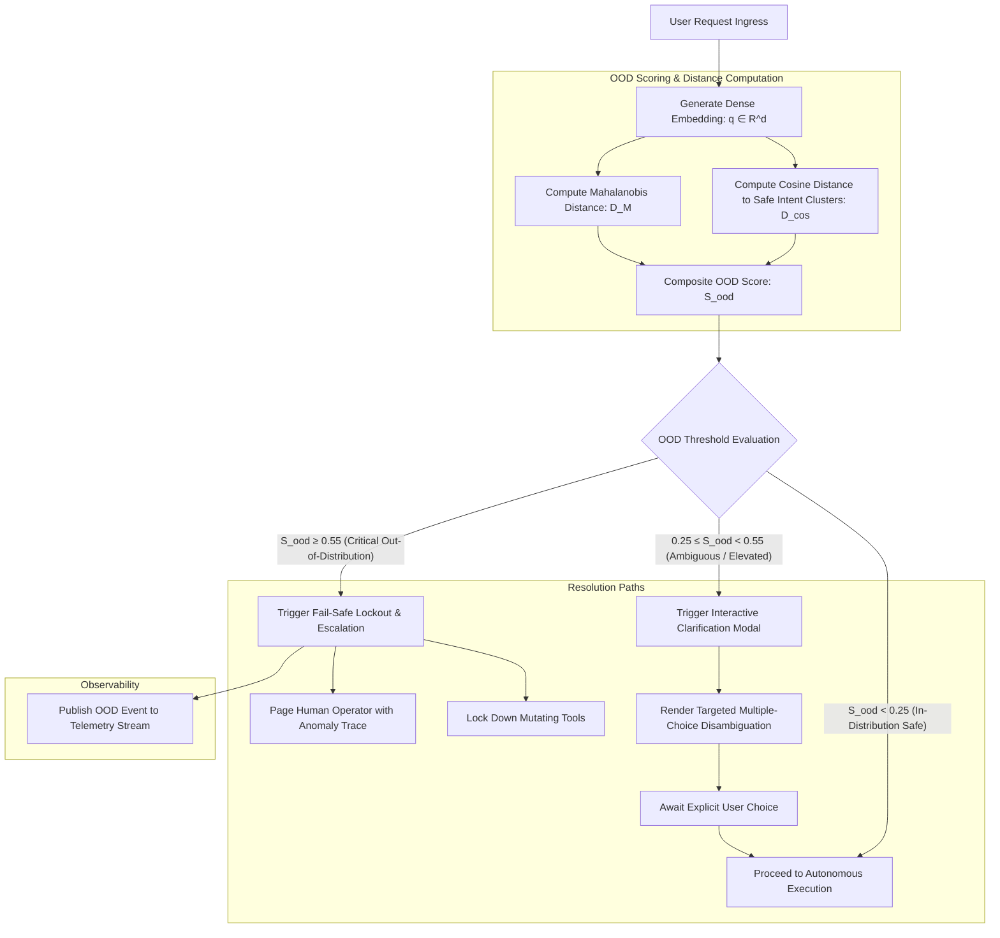

# SPEC-003: Out-of-Distribution (OOD) Intent Scoring & Deterministic Safe Fallbacks

## 1. Executive Summary & Theoretical Grounding

> **Deep Learning Concept Reference (Chollet DL Book §14.2)**:
> *"Deep learning excels at local interpolation within known data manifolds, but behaves unpredictably when faced with out-of-distribution (OOD) inputs. In autonomous systems, ungrounded extrapolation leads to hallucinations and catastrophic action execution. A robust system must actively measure its own uncertainty and trigger safe fallback protocols."*

Phient implements an **Out-of-Distribution (OOD) Intent Guardrail Engine** that calculates semantic embedding distance against safe baseline clusters, intercepting anomalous, adversarial, or high-entropy commands before action execution.

---

## 2. Architectural Hierarchy Tree

```
phient::guardrails / phient::ood
├── Vector Embedding OOD Scoring Engine
│   ├── Dense Embedding Generator (Text-Embedding-3 / Local Sentence-Transformers)
│   ├── Safe Intent Cluster Registry (Centroids of verified operational intents)
│   ├── Cosine Anomaly Distance Calculator: D_cos(q, C_safe) = 1.0 - max_c cos(q, c)
│   ├── Mahalanobis Semantic Distance Engine: D_M(q) = sqrt((q - μ)^T Σ^(-1) (q - μ))
│   └── Multi-Cluster Centroid Comparator: Distance to nearest k verified safe clusters
├── Ambiguity & Uncertainty Interceptor
│   ├── Plan Entropy Estimator: H_plan = -sum(p_i * ln(p_i)) over candidate actions
│   ├── Interactive Clarification Modal Generator (Synthesizes multiple-choice options)
│   ├── User Disambiguation Resolver
│   └── Prompt Refinement Pipeline
└── Deterministic Fail-Safe Fallback Subsystem
    ├── Safe Read-Only Mode (Locks all state-mutating tools)
    ├── Atomic Execution Freeze (Pauses all active autonomous loops)
    ├── Human-in-the-Loop Escalation Router (Pages operator on high-risk OOD events)
    └── Anomaly Telemetry Streamer (Pushes alert to Puijs Operations Cockpit)
```

---

## 3. Component Interaction & Execution Flow



---

## 4. Technical Specification & Data Structures

### 4.1 OOD Scoring Metrics & Action Thresholds

| Metric | Mathematical Formula | Safe Range | Ambiguity Range | Critical OOD Range | Action Taken | Recovery Policy |
| :--- | :--- | :--- | :--- | :--- | :--- | :--- |
| **Cosine Outlier $D_{\text{cos}}$** | $1.0 - \max_c \frac{\mathbf{q} \cdot \mathbf{c}}{\|\mathbf{q}\| \|\mathbf{c}\|}$ | $[0.0, 0.25)$ | $[0.25, 0.50)$ | $\ge 0.50$ | Clarification on elevated; hard lockout on critical | Verified human approval |
| **Mahalanobis Distance $D_M$** | $\sqrt{(\mathbf{q} - \mathbf{\mu})^T \mathbf{\Sigma}^{-1} (\mathbf{q} - \mathbf{\mu})}$ | $[0.0, 3.0)$ | $[3.0, 6.0)$ | $\ge 6.0$ | Locks all cluster mutation tools | Re-calibration of baseline |
| **Plan Entropy $H_{\text{plan}}$** | $-\sum_{i=1}^K p_i \ln p_i$ | $[0.0, 0.30]$ | $[0.30, 0.65]$ | $\ge 0.65\text{ nats}$ | Generates multiple-choice options | Single selection choice |
| **Action Risk Level** | Categorical Tier | Tier 1 (Read) | Tier 2 (Soft Mod) | Tier 3 (Delete/Transfer) | Tier 3 requires explicit two-man confirmation | 2-party signoff |

---

## 5. Python Implementation Signatures

```python
from typing import Any, Dict, List, Optional, Tuple
import numpy as np
from pydantic import BaseModel, Field

class OodEvaluationResult(BaseModel):
    is_safe: bool
    requires_clarification: bool
    is_critical_ood: bool
    cosine_distance: float
    mahalanobis_distance: float
    entropy_nats: float
    recommended_action: str
    nearest_cluster_id: str

class OodIntentFilter:
    def __init__(
        self,
        cluster_centroids: np.ndarray,
        covariance_inv: np.ndarray,
        safe_threshold: float = 0.25,
        critical_threshold: float = 0.55,
    ):
        self.centroids = cluster_centroids
        self.covariance_inv = covariance_inv
        self.safe_threshold = safe_threshold
        self.critical_threshold = critical_threshold

    def evaluate_intent(self, embedding: np.ndarray) -> OodEvaluationResult:
        ...

    def generate_clarification_prompt(self, query: str, candidate_intents: List[str]) -> Dict[str, Any]:
        ...

    def apply_fail_safe_lockdown(self, agent_state: Dict[str, Any]) -> Dict[str, Any]:
        ...

    def log_anomaly_event(self, result: OodEvaluationResult, query: str) -> None:
        ...
```

---

## 6. Verification & Test Criteria

1. **Adversarial Injection Detection**: Submitting adversarial prompt injection strings designed to trigger unauthorized shell execution must score $D_{\text{cos}} \ge 0.55$, triggering instant lockdown.
2. **Ambiguity Interception Accuracy**: Submitting deliberately underspecified prompts (e.g. "update the config") must be flagged as elevated entropy ($H > 0.30$), displaying interactive choices.
3. **Sub-10ms Filtering Overhead**: Embedding generation and matrix distance calculation must complete in $<10\text{ms}$ on standard CPU inference.
4. **False Positive Suppression**: Benchmark validation across 1,000 standard operational queries must yield $<0.5\%$ false positive rejection rate.
5. **Fail-Safe Integrity**: In locked mode, all tool calls attempting to delete or mutate files must raise `PermissionDeniedSecurityError`.
