# Phient Enterprise Multi-Cloud Integration Guide

This guide details how to integrate the **Phient Enterprise Platform** and the **`phiadk` SDK (`P*` Ontology Layer)** with **Microsoft Azure**, **Amazon Web Services (AWS)**, **Google Cloud Platform (GCP)**, **Snowflake**, **Databricks**, and **Palantir Foundry**.

---

## Architecture Overview

Phient functions as an enterprise multi-cloud operational layer:
- **`PClient` / `POntology`**: Standardized semantic abstraction layer across all clouds.
- **`PObjectType`, `PPropertyType`, `PLinkType`, `PActionType`**: Cloud-agnostic schema representation.
- **`PhiBus` & `PhiMen`**: Multi-cloud orchestration and event routing.

```mermaid
graph TD
  subgraph "Phient Enterprise Core"
    PClient["PClient / PAsyncClient"]
    POntology["POntology Engine (POntologyEngine)"]
    Agents["15 Phient Domain Agents (PAgent)"]
    PhiBus["PhiBus Event Mesh (PBusEvent)"]
  end

  subgraph "Microsoft Azure"
    AzureOpenAI["Azure OpenAI (GPT-4o / o1)"]
    EntraID["Microsoft Entra ID (OAuth2)"]
    CosmosDB["Cosmos DB / Fabric"]
    EventGrid["Event Grid & Service Bus"]
  end

  subgraph "Amazon Web Services (AWS)"
    Bedrock["AWS Bedrock (Claude 3.5 Sonnet)"]
    AWSS3["S3 Lakehouse & Glue Catalog"]
    SQS["SQS / EventBridge"]
    SageMaker["SageMaker Serverless"]
  end

  subgraph "Google Cloud & Modern Lakehouse"
    VertexAI["GCP Vertex AI (Gemini 1.5 Pro)"]
    Snowflake["Snowflake Cortex & Iceberg"]
    Databricks["Databricks Unity Catalog"]
    Foundry["Palantir Foundry REST API v2"]
  end

  PClient --> AzureOpenAI
  PClient --> Bedrock
  PClient --> VertexAI
  POntology --> EntraID
  POntology --> AWSS3
  POntology --> Snowflake
  POntology --> Databricks
  POntology --> Foundry
  PhiBus --> EventGrid
  PhiBus --> SQS
```



---

## 1. Microsoft Azure Integration

### 1.1 Azure OpenAI & Managed Identity Authentication
Integrate Phient's LLM engine (`phillm`) and agent reasoning loop with Azure OpenAI using passwordless `DefaultAzureCredential`.

```python
import os
from azure.identity import DefaultAzureCredential, get_bearer_token_provider
from phiadk import PClient, POntologyEngine

# 1. Initialize Azure Token Provider for Managed Identity
credential = DefaultAzureCredential()
token_provider = get_bearer_token_provider(
    credential, "https://cognitiveservices.azure.com/.default"
)

# 2. Configure PClient with Azure OpenAI Endpoint
client = PClient(
    hostname="https://eastus2.api.cognitive.microsoft.com",
    auth=credential,
    config={
        "azure_openai_endpoint": os.getenv("AZURE_OPENAI_ENDPOINT"),
        "azure_deployment": "gpt-4o",
        "api_version": "2024-08-01-preview",
    }
)

# 3. Query Ontology via Azure LLM Agent
emp = client.ontologies.Object.get("Employee", "sarah.connor@enterprise.com")
print(f"Loaded Employee Object: {emp.primary_key}")
```

### 1.2 Microsoft Entra ID Synchronization
Map Entra ID User Principals and Groups directly into Phient `UserIdentity` and `Employee` Object Types:

```python
from phiadk import PClient, PActionType, PActionParameter

client = PClient()

# Execute Action to provision synchronized cloud identity
receipt = client.ontologies.Action.apply(
    action_type="provision_identity",
    parameters={
        "email": "sarah.connor@enterprise.com",
        "groups": "Security-Admins,Cloud-Architects"
    },
    branch="master"
)
print("Entra ID Provisioning Receipt:", receipt["status"])
```

---

## 2. Amazon Web Services (AWS) Integration

### 2.1 AWS Bedrock & Claude 3.5 Sonnet
Connect Phient to AWS Bedrock foundation models with IAM Role Assumption:

```python
import boto3
from phiadk import PClient

# Initialize AWS Bedrock Runtime Client
bedrock = boto3.client(
    service_name="bedrock-runtime",
    region_name="us-east-1"
)

# Bind Bedrock with PClient
client = PClient(
    config={
        "llm_provider": "aws_bedrock",
        "bedrock_model_id": "anthropic.claude-3-5-sonnet-20240620-v1:0",
        "region": "us-east-1"
    }
)
```

### 2.2 S3 Data Lakehouse & Athena / Glue Catalog
Federate datasets from AWS S3 Parquet / Iceberg into Phient `POntologyObjectSet`:

```python
from phiadk import PClient

client = PClient()

# Query S3-backed ObjectSet
documents = client.ontologies.ObjectSet.of_type("DocumentPage")
filtered_docs = documents.filter(lambda doc: doc.get("category") == "Architecture")

print(f"Matched {len(filtered_docs)} architecture documents from AWS S3.")
```

---

## 3. Google Cloud Platform (GCP) Integration

### 3.1 Vertex AI & Gemini 1.5 Pro
Integrate Google Cloud's multimodal Gemini 1.5 Pro engine:

```python
from phiadk import PClient

client = PClient(
    config={
        "llm_provider": "gcp_vertex",
        "vertex_project": "enterprise-ai-prod",
        "vertex_location": "us-central1",
        "vertex_model": "gemini-1.5-pro-001"
    }
)
```

---

## 4. Snowflake Cortex & Databricks Unity Catalog

### 4.1 Snowflake Cortex Integration
Sync Snowflake relational tables and Cortex Search into Phient Ontologies:

```python
from phiadk import PClient

client = PClient()

# Execute RQL (Relational Query Language) over Snowflake warehouse
query_result = client.rql("EMPLOYEE_ANALYTICS_VIEW") \
    .filter(department="Engineering") \
    .limit(10) \
    .execute()

print("Snowflake Query Rows:", len(query_result.rows))
```

### 4.2 Databricks Unity Catalog
Sync Delta Tables directly into Phient `POntologyObjectSet` instances with schema validation.

---

## 5. Palantir Foundry Bidirectional Synchronization

Phient delivers 1:1 API parity with Palantir Foundry REST API v2 (`/api/v2/ontologies/`):

| Palantir Foundry REST API v2 | Phient SDK Equivalent |
|---|---|
| `GET /api/v2/ontologies/{ontologyRid}` | `client.ontologies.get()` |
| `GET /api/v2/ontologies/{ontologyRid}/objectTypes/{objectType}` | `client.ontologies.ObjectType.get(object_type)` |
| `GET /api/v2/ontologies/{ontologyRid}/objects/{objectType}/{primaryKey}` | `client.ontologies.Object.get(object_type, primary_key)` |
| `POST /api/v2/ontologies/{ontologyRid}/actions/{actionType}/apply` | `client.ontologies.Action.apply(action_type, params)` |
| `POST /api/v2/ontologies/{ontologyRid}/objects/{objectType}/search` | `client.ontologies.ObjectSet.of_type(object_type).filter(pred)` |
| `GET /api/v2/ontologies/{ontologyRid}/interfaceTypes/{interfaceType}` | `client.ontologies.Interface.get(interface_name)` |
| `POST /api/v2/ontologies/{ontologyRid}/queries/{queryType}/execute` | `client.ontologies.Query.execute(query_name, params)` |

### 5.1 Foundry Action Webhook Consumer
When Palantir Foundry executes an action, configure a Webhook to Phient FastAPI Gateway (`/v2/ontologies/actions/apply`), which executes within milliseconds and returns atomic mutation hashes.

---

## Summary Matrix

| Cloud Provider | Authentication | LLM / Reasoning Engine | Data / Vector Storage | Event Streaming |
|---|---|---|---|---|
| **Microsoft Azure** | Entra ID / Managed Identity | Azure OpenAI (GPT-4o, o1) | Azure Cosmos DB / Fabric | Event Grid / Service Bus |
| **AWS** | AWS IAM / STS AssumeRole | AWS Bedrock (Claude 3.5) | S3 Iceberg / OpenSearch | AWS SQS / EventBridge |
| **Google Cloud** | GCP Workload Identity | Vertex AI (Gemini 1.5 Pro) | BigQuery / Vertex Search | GCP Pub/Sub |
| **Snowflake** | Key-Pair / OAuth | Snowflake Cortex LLM | Snowflake Iceberg Tables | Snowflake Streams |
| **Databricks** | Databricks PAT / OAuth | Databricks Foundation Models | Unity Catalog Delta Lake | Databricks Structured Streaming |
| **Palantir Foundry** | Multipass Bearer Token | Palantir AIP Assist | Foundry Ontology / Object Sets | Foundry Webhooks / Kafka |
