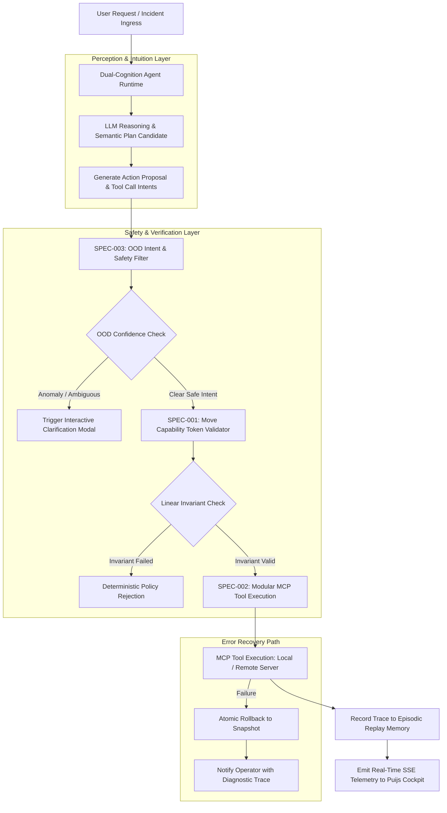

# Phient Cognitive Specifications: Chapter 14 Autonomous Agent Runtime

## 1. Executive Overview

This directory contains the formal architectural specifications applying the principles from **Chapter 14 ("Conclusions") of François Chollet's *Deep Learning with Python* (2nd Edition)** to the Phient autonomous AI Ops agent platform:

| Spec ID | Specification Document | Core Chapter 14 Mechanism | Target Modules | Primary Architectural Invariant |
| :--- | :--- | :--- | :--- | :--- |
| **SPEC-001** | [`001_dual_cognition_agent_runtime.md`](./001_dual_cognition_agent_runtime.md) | **14.4 Dual-Cognition (Neural Intuition + Policy Verification)** | `src/agent/runtime.py`, `src/graph.py` | Continuous LLM reasoning coupled with deterministic LangGraph invariant guards |
| **SPEC-002** | [`002_subroutine_registry_and_mcp.md`](./002_subroutine_registry_and_mcp.md) | **14.5B Lifelong Subroutine Reuse & MCP Tool Registry** | `src/tools/mcp_registry.py` | Dynamic MCP tool discovery, episodic memory replay, and composable pipelines |
| **SPEC-003** | [`003_ood_intent_guardrails.md`](./003_ood_intent_guardrails.md) | **14.2 OOD Anomaly Detection & Safe Fallbacks** | `src/guardrails/ood_filter.py` | Cosine distance clustering against out-of-distribution hallucinations |

---

## 2. Global Cognitive Architecture Hierarchy

```
Phient Autonomous Agent Ecosystem
├── Layer 1: Dual-Cognition Orchestration Runtime (SPEC-001)
│   ├── Value-Centric Intuition Engine (Claude 3.5 Sonnet / Local LLMs)
│   │   ├── Multi-Step Planning & Chain-of-Thought
│   │   ├── Fuzzy Intent Extraction & Context Synthesis
│   │   └── Probabilistic Decision Confidence Scoring
│   └── Program-Centric Symbolic Verifier (LangGraph State Machine)
│       ├── Move-Style Linear Capability Tokens (Single-Execution Guarantees)
│       ├── Deterministic Policy Checker (Authorization, Boundaries, Limits)
│       └── Atomic State Rollback Snapshots (Zero Partial-Mutation Guarantee)
├── Layer 2: Modular MCP Subroutine Registry (SPEC-002)
│   ├── Model Context Protocol (MCP) Server Discovery & Hot-Registration
│   ├── Composable Subroutine DAG Pipeline Builder
│   ├── Lifelong Episodic Memory Replay Buffer (Success Traces Preserved)
│   └── Tool Parameter Schema Typechecker & Synthesizer
└── Layer 3: OOD Intent Guardrails & Safety Filter (SPEC-003)
    ├── Vector Embedding Intent Clustering (ChromaDB Vector Store)
    ├── Cosine Outlier Distance Scoring: D_cos(q, C_safe)
    ├── Mahalanobis Anomaly Distance Engine: D_M(q)
    ├── Interactive Ambiguity Clarification Modal Trigger
    └── Fail-Safe Rollback Circuit (Graceful Fallback on Tool Failure)
```

---

## 3. Global Data Flow & Processing Pipeline



---

## 4. Technical Specification Matrix

| Metric / Parameter | Evaluation Method | Nominal Target | Critical Threshold | System Action | Downstream Impact |
| :--- | :--- | :--- | :--- | :--- | :--- |
| **Plan Confidence $\mathcal{P}_{\text{conf}}$** | LLM Logit / Semantic Score | $\ge 0.85$ | $<0.70$ | Pauses execution, queries user | Prevents speculative execution |
| **Cosine Outlier $D_{\text{cos}}$** | $\min_{c} (1.0 - \cos(\mathbf{q}, \mathbf{c}))$ | $\le 0.30$ | $>0.55$ | Rejects prompt as unsafe / OOD | Triggers hard lockdown mode |
| **Mahalanobis Distance $D_M$**| Multivariate Covariance | $\le 3.0$ | $>6.0$ | Locks all mutating tools | Escalates incident to human |
| **Linear Capability Token** | Move Linear Single-Use Token | 1 token per action | Token exhaustion | Blocks replay / unauthorized calls | Guarantees non-reentrancy |
| **MCP Execution Timeout** | Wall-clock execution time | $<5.0\text{s}$ | $>15.0\text{s}$ | Aborts tool call and triggers fallback | Prevents hung process deadlocks |

---

## 5. Architectural Quality Attributes & Operational Constraints

1. **Linear Action Capabilities**: High-risk operations (e.g. cloud resource provisioning, capital transfers) require single-use capability tokens that are consumed upon execution.
2. **Deterministic Fallback Guarantees**: Any tool execution failure triggers an automatic atomic rollback to the pre-execution snapshot.
3. **Lifelong Reusable Tool Registry**: Verified tool chains are stored in the episodic registry to accelerate multi-step task resolution.
4. **Transparent Observability**: Real-time agent decision traces and capability statuses stream directly to the `puijs` operations cockpit.
5. **Bounded Recursion Depth**: Agent multi-step planning loops are hard-bounded to a maximum of 25 steps per user invocation.

---

## 6. Glossary of Agent Architecture Terms

| Term | Formal Definition | Role in System Architecture |
| :--- | :--- | :--- |
| **LangGraph State Machine** | Graph of deterministic transitions and conditional edges | Enforces workflow invariants and checkpoint snapshots |
| **Linear Capability Token** | Non-duplicable computational token consumed on action | Eliminates double-spend and unauthorized re-entrancy |
| **MCP (Model Context Protocol)** | Standardized JSON-RPC protocol for agent tools and context | Bridges agent with external cloud, git, and financial APIs |
| **Episodic Replay Memory** | Vector-indexed database of past successful execution chains | Enables zero-shot transfer learning across recurring tasks |
