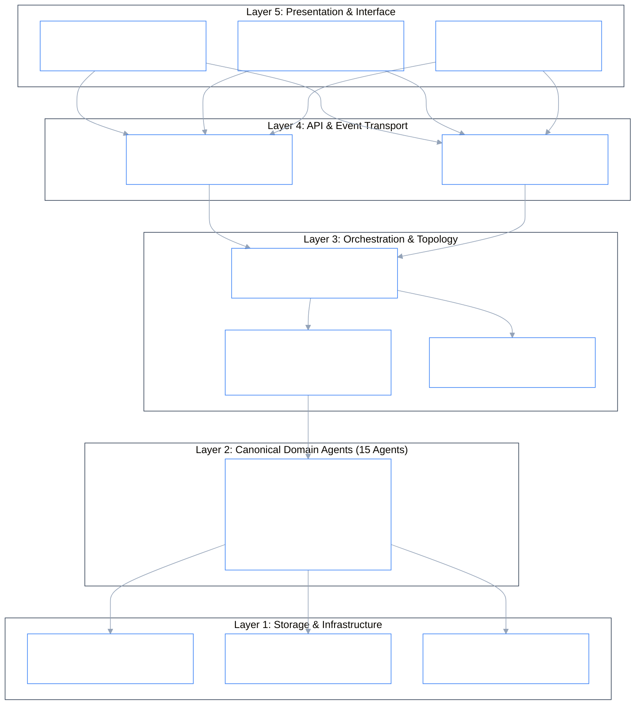
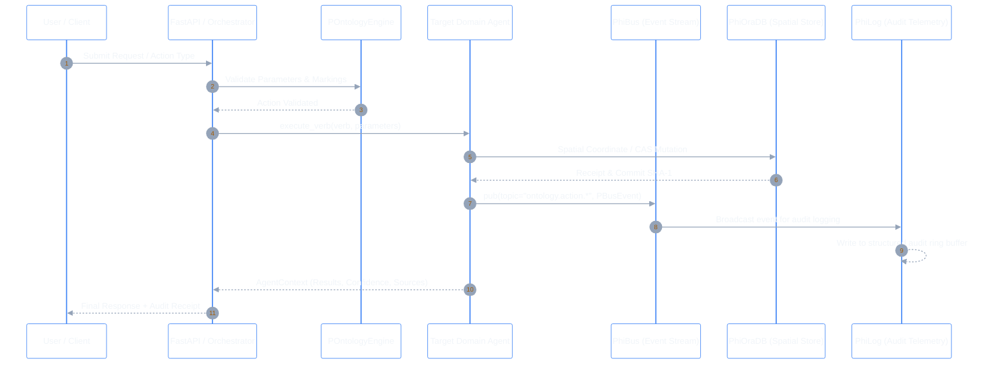
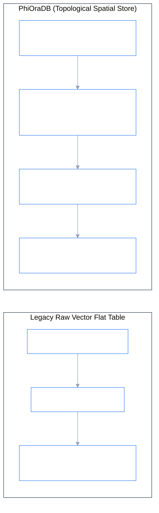

# Architecture Specification

## 1. System Overview

The Phient Agentic Ecosystem is an enterprise multi-agent platform that orchestrates specialized AI agents across global workforce operations. It integrates with enterprise systems (Microsoft Entra ID, Notion, Enterprise HRIS), provides topological ontology governance (**POntologyEngine**), real-time pub/sub event bus (**PhiBus**), and content-addressed topological spatial storage (**PhiOraDB**).

---

## 2. Layered Architecture Diagram

---

## 3. End-to-End Request & Event Lifecycle

---

## 4. Storage Architecture: PhiOraDB (Spatial Store vs Raw Vector)

---

## 5. Technology Stack

| Layer | Technology | Purpose |
|-------|-----------|---------|
| **LLM Gateway** | Claude 3.5 Sonnet / Multi-Provider Gateway | Agent reasoning, intent classification, generation |
| **Orchestrator** | PhiADK Orchestrator | 20-Namespace Palantir routing & priority queuing |
| **Ontology Engine** | POntologyEngine | Category-theoretic 0/1-simplex state machine |
| **Spatial Store** | **PhiOraDB** | Topological spatial store, coordinate indexing, CAS |
| **Event Bus** | **PhiBus** (`PBusClient`) | High-throughput pub/sub event stream |
| **Git Engine** | **PhiGit** (`GitEngine`) | Content-addressed SHA-1 blobs, trees, and commit lineage |
| **Audit & Telemetry** | **PhiLog** (`StructuredLogger`) | Cryptographic audit trails & ring buffer |
| **API Server** | FastAPI + Uvicorn | REST, SSE streaming, OpenAPI documentation |
| **MCP** | Model Context Protocol | Claude Desktop assistant toolchain |
| **Identity & Admin** | Microsoft Entra ID + HRIS | Employee directory & access management |

---

## 6. Phient Ontologies & Multi-Cloud Architecture (P* Standards)

Phient adheres to the enterprise `P*` naming convention and 1:1 Palantir Foundry API parity:
- **`PClient` / `PAsyncClient`**: Central unified client entry point with modular domain accessors.
- **`POntology` & `POntologyEngine`**: Central graph ontology schema management.
- **`PObjectType`, `PPropertyType`, `PLinkType`, `PActionType`**: Schema definition classes.
- **`POntologyObject`, `POntologyObjectSet`**: Runtime object and collection manipulation.
- **`PAgent`, `PNode`, `PSpace`, `PMorphism`**: Universal foundation abstractions.
- **`POraDB` / `PhiOraDB`**: First-class spatial store and dataset engine.

For complete deployment specifications across Microsoft Azure, AWS, GCP, Snowflake, Databricks, and Palantir Foundry, refer to [specs/MULTI_CLOUD_INTEGRATION_GUIDE.md](file:///c:/Users/phiac/Workspace/gemphi/phient/specs/MULTI_CLOUD_INTEGRATION_GUIDE.md).
