# PhiADK: Enterprise Agent Development Kit

> _The Master Python SDK for Palantir Foundry-Symmetrical Enterprise Agentic AI & Ontology Operations._

[](../../look.md)
[](./agents/README.md)
[](./ontologies/README.md)
[](./agents/phibus/README.md)
[](./agents/phiora/README.md)

---

## 1. Architectural Architecture & Subsystems

`phiadk` is organized into modular subsystems that map 1:1 to Palantir Foundry Platform Python SDK architecture:

```mermaid
%%{init: {'theme': 'base', 'themeVariables': {'background': 'transparent', 'mainBkg': 'transparent', 'nodeBorder': '#3b82f6', 'clusterBkg': 'transparent', 'clusterBorder': '#475569', 'lineColor': '#60a5fa', 'textColor': '#ffffff', 'primaryTextColor': '#ffffff', 'nodeTextColor': '#ffffff', 'edgeLabelBackground': '#0f172a'}}}%%
%%{init: {'theme': 'base', 'themeVariables': {'background': 'transparent', 'mainBkg': 'transparent', 'nodeBorder': '#3b82f6', 'clusterBkg': 'transparent', 'clusterBorder': '#334155', 'lineColor': '#94a3b8', 'textColor': '#f1f5f9'}}}%%
graph TD
    subgraph "Master Client Layer"
        Client["PhiADKClient / PClient"]
    end

    subgraph "Core Foundations"
        Core["_core: Auth, Config, ModelBase, Topology, Connectors"]
        Errors["_errors: Error Hierarchy & Exceptions"]
    end

    subgraph "Domain Agent Subsystems (15 Agents)"
        Agents["agents/ (phibot, phibrd, phibus, phical, phidoc, phigen, phigit, phigov, phillm, philog, phimen, phione, phiora, phirag, phisec)"]
    end

    subgraph "Palantir Foundry Ontologies Engine"
        Onto["ontologies/: ObjectType, LinkType, ActionType, Interface, Scenario, Transaction, Geo, TimeSeries, Cipher"]
    end

    subgraph "Runtime & Services"
        Orch["orchestrator/: 20-Namespace Router & Priority Queue"]
        MCP["mcp/: Model Context Protocol Server (Claude Integration)"]
        API["phiapi/: AIP FastAPI Server & Blueprint Console"]
        CLI["phicli/: Developer Toolchain CLI"]
        Query["query/: RQL, OQL, QML, VQL Multi-Dialect Runtime"]
    end

    Client --> Core & Errors
    Client --> Onto
    Client --> Agents
    Client --> Orch & MCP & API & CLI & Query
```



---

## 2. Directory Layout & Module Overview

| Subsystem | Folder | Responsibility & Reference |
|:---|:---|:---|
| **`agents/`** | [`agents/`](./agents/README.md) | 15 Canonical 6-Letter domain agents implementing the 4-phase lifecycle (`envision` $\rightarrow$ `apply` $\rightarrow$ `eval` $\rightarrow$ `iterate`). |
| **`ontologies/`** | [`ontologies/`](./ontologies/README.md) | Palantir Foundry Symmetrical Ontologies Engine (`POntologyEngine`, `ObjectType`, `LinkType`, `ActionType`, `Scenario`, `Transaction`). |
| **`orchestrator/`** | [`orchestrator/`](./orchestrator/README.md) | Multi-agent execution coordinator with 20 Palantir namespace routing and priority scoring (`P1_CRITICAL` to `P4_LOW`). |
| **`mcp/`** | [`mcp/`](./mcp/README.md) | Model Context Protocol (MCP) server exposing enterprise tools to Claude Desktop and Claude Code. |
| **`query/`** | [`query/`](./query/README.md) | Multi-language query execution engine supporting `RQL` (Relational), `OQL` (Ontological), `QML` (Quantum), and `VQL` (Vector). |
| **`phiapi/`** | [`phiapi/`](./phiapi/README.md) | AIP FastAPI REST & SSE Gateway with interactive Blueprint Console dashboard. |
| **`phicli/`** | [`phicli/`](./phicli/README.md) | Rich CLI toolchain for scaffolding agents, executing parity scans, and debugging the ontology graph. |
| **`_core/`** | [`_core/`](./_core/README.md) | Universal primitives: `Auth`, `Config`, `ApiClient`, `ModelBase`, `DataSet`, `Topology` and enterprise connectors. |
| **`_errors/`** | [`_errors/`](./_errors/) | Strongly-typed error taxonomy (`PhiADKException`, `OntologyError`, `ActionExecutionError`). |

---

## 3. Quickstart & Master Client Usage

```python
import asyncio
from phiadk import PhiADKClient, PClient

async def main():
    # 1. Initialize master client
    client = PhiADKClient()

    # 2. Access Ontology Engine
    engine = client.ontologies._engine
    print(f"Ontology '{engine.name}' loaded with {len(engine.object_types)} Object Types")

    # 3. Execute Domain Agent Actions
    emp_res = await client.agents["phione"].execute_verb(
        "lookup_employee",
        {"email": "jane@phient.com"}
    )
    print("Employee:", emp_res.results.get("output"))

    # 4. Query Spatial Store (PhiOraDB)
    neighbors = client.phiora.query_nearest(
        target_coords=[10.0, 20.0, 5.0],
        k=3
    )
    print("Spatial Neighbors:", neighbors)

    # 5. Broadcast Event on PhiBus
    client.phibus.pub(
        "workforce.update",
        {"status": "SYNCED", "count": 1}
    )

asyncio.run(main())
```

---

## 4. Testing & Validation

```bash
# Run pytest across all subsystems
pytest tests --no-cov
```
