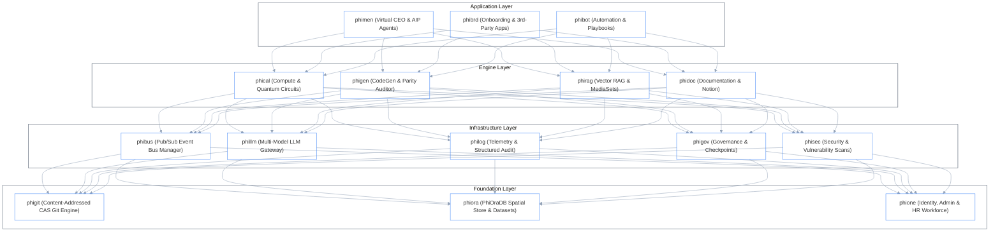

# Canonical Domain Agents (`src/phiadk/agents/`)

> _15 Strictly 6-Letter Domain Agents Implementing the Universal 4-Phase Lifecycle._

---

## 1. Fleet Architecture & Topological Layers

All 15 domain agents inherit from `PhiAgent` and are organized into four enterprise architectural layers:



---

## 2. The 15 Domain Agents Matrix

| Agent | Domain | Layer | Palantir Namespace | Primary Verbs / Actions |
|:---|:---|:---|:---|:---|
| [`phibot`](./phibot/) | Automation | `APPLICATION` | `orchestration` | `execute_playbook`, `list_playbooks`, `schedule_job` |
| [`phibrd`](./phibrd/) | Onboarding | `APPLICATION` | `third_party_applications` | `onboard_employee`, `track_lifecycle`, `verify_access` |
| [`phibus`](./phibus/) | Event Bus | `INFRASTRUCTURE` | `connectivity` | `publish_event`, `subscribe_topic`, `list_topics`, `get_history` |
| [`phical`](./phical/) | Compute | `ENGINE` | `functions` | `eval_circuit`, `quantum_measure`, `born_rule` |
| [`phidoc`](./phidoc/) | Docs | `ENGINE` | `filesystem` | `search_pages`, `get_page`, `sync_notion` |
| [`phigen`](./phigen/) | Synthesis | `ENGINE` | `models` | `generate_types`, `audit_parity`, `verify_schema` |
| [`phigit`](./phigit/) | Git Engine | `FOUNDATION` | `filesystem` | `write_blob`, `commit_tree`, `diff_refs`, `log` |
| [`phigov`](./phigov/) | Governance | `INFRASTRUCTURE` | `checkpoints` | `check_compliance`, `evaluate_guardrail`, `approval_gate` |
| [`phillm`](./phillm/) | LLM Gateway | `INFRASTRUCTURE` | `language_models` | `generate_text`, `stream_tokens`, `classify_intent` |
| [`philog`](./philog/) | Telemetry | `INFRASTRUCTURE` | `audit` | `log`, `tail`, `record_audit`, `query_telemetry` |
| [`phimen`](./phimen/) | Executive | `APPLICATION` | `aip_agents` | `strategic_plan`, `decompose_goal`, `execute_cycle` |
| [`phione`](./phione/) | Identity/HR | `FOUNDATION` | `admin` | `lookup_employee`, `lookup_user`, `get_leave_balance` |
| [`phiora`](./phiora/) | Storage | `FOUNDATION` | `datasets` | `spatial_insert`, `query_nearest`, `query_bounding_box` |
| [`phirag`](./phirag/) | RAG | `ENGINE` | `media_sets` | `answer_query`, `chunk_document`, `semantic_search` |
| [`phisec`](./phisec/) | Security | `INFRASTRUCTURE` | `data_health` | `scan_target`, `verify_token`, `enforce_policy` |

---

## 3. Universal 4-Phase Topological Lifecycle

Every agent executes its actions through four mathematical phases:

```
1. ENVISION: Plan the operation, determine target space & validate input schema.
2. APPLY:    Execute state mutations, spatial operations, or tool invocations.
3. EVAL:     Assess quality, verify invariants, and compute numerical confidence (0.0 to 1.0).
4. ITERATE:  Refine if confidence < threshold, scale sub-tasks, and emit telemetry.
```
