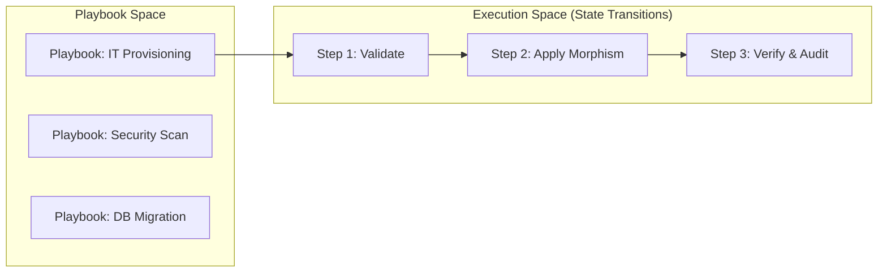

# PhiBot: Automation & Playbook Ontologylogy

PhiBot manages the topological graph of executable automation playbooks, validating preconditions and executing deterministic state transitions.

## 1. Playbook Directed Acyclic Graph (DAG)



### Space Representation
```
[ Playbook Space ] ──(execute_playbook)──► [ Execution DAG ]
       │                                            │
       ├─► (it_ops)                                 ├─► [ Step 1: Preconditions ]
       ├─► (security)                               ├─► [ Step 2: Webhook/Action ]
       └─► (hr_flows)                               └─► [ Step 3: Audit Emission ]
```

## 2. Inter-Agent Dependencies & Inheritance

- **Extends**: `PhiAgent`
- **Depends on**: `phiora` (Playbook definitions), `philog` (Audit recording)
- **Feeds into**: `phibrd` (Automated employee equipment setup)
